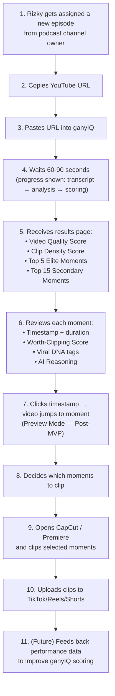
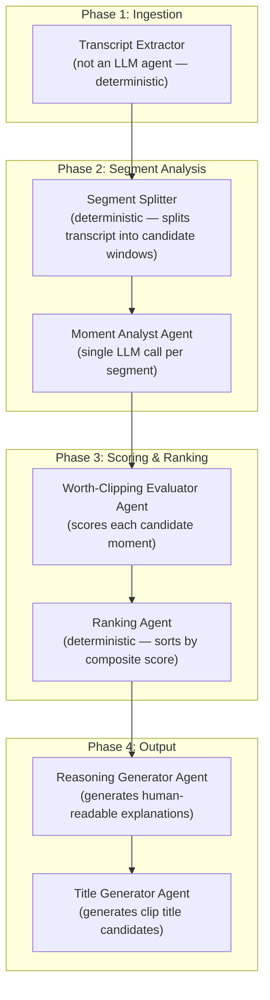
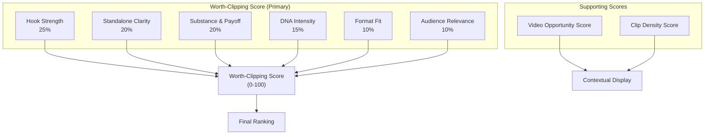
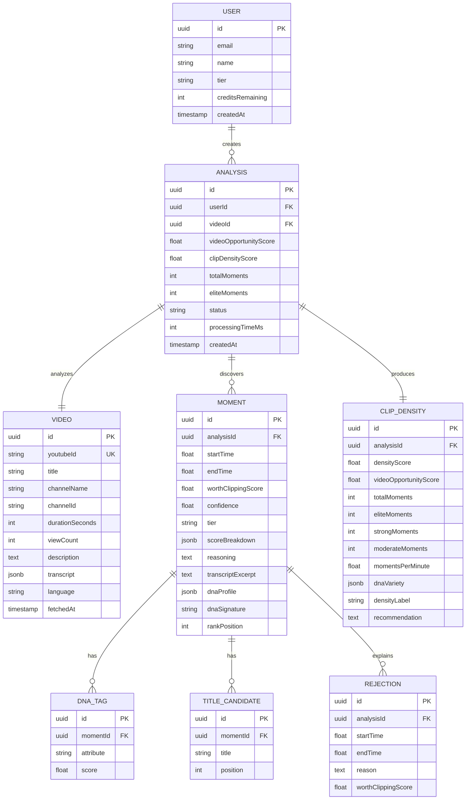
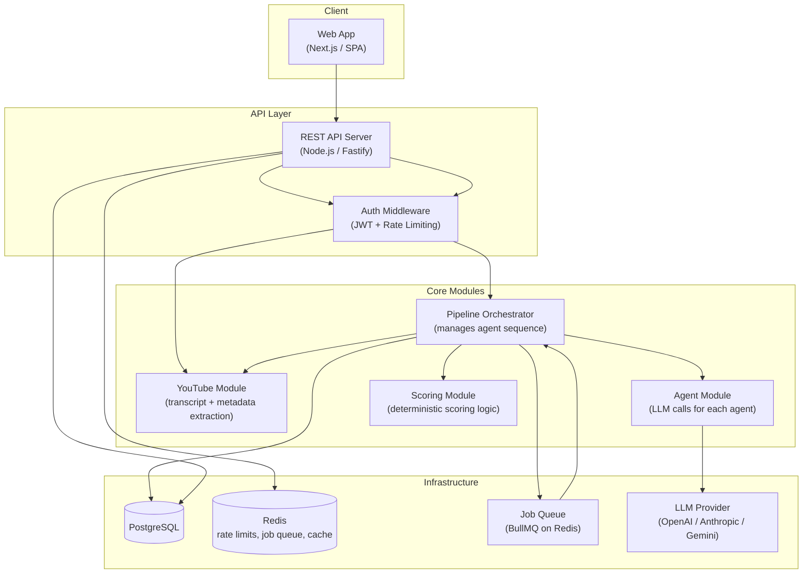

# ganyIQ — Product Design Document

> **Version:** 0.1 (Founder Draft)
> **Date:** 2026-06-01
> **Status:** Requires Review
> **Author:** Co-Founder / Technical Product Architect

---

## Table of Contents

1. [Executive Summary](#1-executive-summary)
2. [Product Vision](#2-product-vision)
3. [Product Positioning](#3-product-positioning)
4. [User Personas](#4-user-personas)
5. [User Journey](#5-user-journey)
6. [Core Features](#6-core-features)
7. [Multi-Agent Architecture](#7-multi-agent-architecture)
8. [Viral DNA Engine Design](#8-viral-dna-engine-design)
9. [Worth-Clipping Engine Design](#9-worth-clipping-engine-design)
10. [Scoring Framework](#10-scoring-framework)
11. [Confidence Engine](#11-confidence-engine)
12. [Clip Density Engine](#12-clip-density-engine)
13. [Data Models](#13-data-models)
14. [Database Schema](#14-database-schema)
15. [API Architecture](#15-api-architecture)
16. [Backend Architecture](#16-backend-architecture)
17. [AI Prompt Architecture](#17-ai-prompt-architecture)
18. [MVP Scope](#18-mvp-scope)
19. [V2 Roadmap](#19-v2-roadmap)
20. [V3 Roadmap](#20-v3-roadmap)
21. [Defensibility Strategy](#21-defensibility-strategy)
22. [Monetization Strategy](#22-monetization-strategy)
23. [Technical Risks](#23-technical-risks)
24. [Product Risks](#24-product-risks)
25. [Validation Strategy](#25-validation-strategy)
26. [Success Metrics](#26-success-metrics)
27. [Recommended Tech Stack](#27-recommended-tech-stack)
28. [Cost Estimation](#28-cost-estimation)
29. [Founder Recommendations](#29-founder-recommendations)
30. [Brutal Critique](#30-brutal-critique)

---

## 1. Executive Summary

ganyIQ is a **Worth-Clipping Discovery Engine** — not a video editor, not an auto-clipper, not a subtitle tool. It answers one question: *"Where are the moments in this long-form video that a professional clipper should spend their time on?"*

**The Problem:** A podcast clipper in Indonesia watches 1-3 hours of raw footage to find 3-5 clippable moments. This is labor-intensive, subjective, and error-prone. The clipper who finds the best moments fastest wins — but most clippers rely on gut instinct, not systematic analysis.

**The Solution:** Paste a YouTube URL. Get back the top 5 elite moments and top 15 secondary moments, each scored for worth-clipping potential, tagged with Viral DNA attributes, and explained with human-readable reasoning. Total time: under 90 seconds vs. 2-4 hours of manual scrubbing.

**Initial Market:** Podcast clippers in Indonesia — a specific, reachable, underserved segment within the broader creator economy. Indonesia has 270M+ people, the 4th largest YouTube audience globally, a booming podcast scene (Deddy Corbuzier, Podcast Awal Minggu, Close The Door, etc.), and a growing class of freelance clippers who monetize through revenue-sharing or per-clip fees.

**Revenue Model:** Freemium SaaS with credit-based usage. Free tier gets 3 analyses/month. Paid tier starts at IDR 99,000/month (~$6 USD) for 30 analyses — deliberately priced for Indonesian purchasing power.

**Defensibility Thesis:** Every analysis feeds a proprietary Viral DNA Dataset. Over time, this dataset becomes a moat: ganyIQ learns what "worth clipping" looks like across thousands of Indonesian podcasts, building pattern recognition no competitor can replicate without the same data volume.

> [!IMPORTANT]
> This is NOT a "let's use AI to do everything" play. The core insight is narrow: **moment discovery is the bottleneck**, and AI can compress it. Everything else — editing, rendering, posting — is solved. Discovery is not.

---

## 2. Product Vision

### The 3-Year Vision

**Year 1:** Become the default discovery tool for Indonesian podcast clippers. Prove that AI-scored moments outperform human-selected moments in engagement metrics at least 60% of the time.

**Year 2:** Expand to adjacent niches (talk shows, interviews, educational content, religious lectures — massive in Indonesia). Layer on audio-based emotion detection and video intelligence. Begin licensing the Viral DNA Dataset to agencies and MCNs.

**Year 3:** Become the "Bloomberg Terminal for short-form content strategy" — a platform where any content operation (agency, MCN, brand) can systematically discover, evaluate, and prioritize clipping opportunities across hundreds of source videos per week.

### The Anti-Vision (What ganyIQ Will Never Be)

- **Not an editor.** CapCut, Premiere, DaVinci exist. We don't compete.
- **Not an auto-clipper.** Opus Clip, Vizard exist. Auto-clipping commoditizes quality. We enable human judgment, not replace it.
- **Not a posting tool.** Buffer, Hootsuite exist.
- **Not a general "AI video tool."** Focus is discovery. Period.

> [!WARNING]
> The biggest risk is scope creep toward editing/rendering. Every feature request that sounds like "can it also cut the clip for me?" must be refused in Year 1. The moment you add editing, you become a worse CapCut with an AI gimmick.

---

## 3. Product Positioning

### Positioning Statement

> For **Indonesian podcast clippers** who struggle to **find the best moments in hours of raw content**, ganyIQ is a **Worth-Clipping Discovery Engine** that **reduces content discovery from hours to seconds** using AI that thinks like a professional clipper. Unlike auto-clippers that output low-quality cuts, ganyIQ **surfaces the moments and lets the human decide how to clip them**.

### Positioning Map

| Dimension | Auto-Clippers (Opus, Vizard) | ganyIQ |
|---|---|---|
| **Input** | Full video file | YouTube URL |
| **Output** | Rendered clips | Scored moments + reasoning |
| **AI Role** | Replace the clipper | Augment the clipper |
| **Quality Model** | "Cut everything, hope something works" | "Find only what's worth clipping" |
| **User Skill** | Low (consumer) | Medium-High (professional clipper) |
| **Value Prop** | Save time on editing | Save time on discovery |
| **Revenue per clip** | Irrelevant (volume play) | Higher (precision play) |

### Key Messaging

- "Stop watching. Start discovering."
- "AI that thinks like a clipper, not a robot."
- "Your first 3 analyses are free. Your first viral clip is priceless."

---

## 4. User Personas

### Persona 1: Rizky — The Freelance Podcast Clipper

| Attribute | Detail |
|---|---|
| **Age** | 19-25 |
| **Location** | Jakarta / Bandung / Surabaya |
| **Income** | IDR 3-8M/month ($190-$510) from clipping |
| **Channels** | Clips for 2-4 podcast channels |
| **Workflow** | Watches full episodes → identifies moments → clips in CapCut → uploads to TikTok/Reels/Shorts |
| **Pain** | Spends 60-70% of work time on discovery, only 30-40% on actual clipping |
| **Willingness to Pay** | IDR 50K-150K/month if ROI is clear |
| **Tech Savvy** | Moderate. Uses mobile + laptop. Comfortable with web apps. |
| **Success Metric** | Views per clip, revenue per month |

### Persona 2: Adi — The Clipper Agency Operator

| Attribute | Detail |
|---|---|
| **Age** | 25-35 |
| **Location** | Jakarta |
| **Income** | IDR 15-40M/month from agency |
| **Operation** | Manages 3-8 clippers, serves 5-15 podcast channels |
| **Workflow** | Assigns episodes to clippers → reviews their clip selections → publishes |
| **Pain** | Quality inconsistency across clippers. Some clippers miss obvious moments. Training is expensive. |
| **Willingness to Pay** | IDR 300K-1M/month for agency-level features |
| **Tech Savvy** | High. Thinks in systems and efficiency. |
| **Success Metric** | Client retention, average views across portfolio |

### Persona 3: Sari — The Podcast Host Who Self-Clips

| Attribute | Detail |
|---|---|
| **Age** | 28-40 |
| **Location** | Any major Indonesian city |
| **Income** | Varies. Podcast is side income or growing channel. |
| **Workflow** | Records episode → tries to clip herself → inconsistent output |
| **Pain** | Not a professional clipper. Doesn't know what makes a good clip. Lacks the "clipper instinct." |
| **Willingness to Pay** | IDR 99K-199K/month |
| **Success Metric** | Channel growth, subscriber count |

> [!NOTE]
> **Persona 1 (Rizky) is the MVP target.** Persona 2 is the expansion target (V2 — team features). Persona 3 is a secondary acquisition channel but NOT the design target. Designing for Sari first would dilute the product. Clippers have sharper needs and faster feedback loops.

---

## 5. User Journey

### MVP User Journey (Rizky)



### Emotional Journey

| Step | Emotion | Design Implication |
|---|---|---|
| Paste URL | Hopeful, slightly skeptical | Instant feedback. No friction. No signup wall for first use. |
| Waiting | Anxious | Show real-time progress. Not a spinner — show *what* the AI is doing. |
| See results | Surprised (if good), dismissive (if bad) | First result must be obviously correct. If Rizky sees a moment he already knew was gold, trust is established. |
| Review reasoning | Curious | Reasoning must sound like a clipper, not a professor. "This has a strong hook because the guest drops a controversial claim in the first sentence." |
| Decide to clip | Empowered | ganyIQ didn't decide for him. He decided. ganyIQ just made the decision faster. |

---

## 6. Core Features

### MVP Features

| # | Feature | Description | Priority |
|---|---|---|---|
| F1 | **YouTube URL Input** | Paste a YouTube URL. System extracts video metadata and transcript. | P0 |
| F2 | **Video Quality Assessment** | Before full analysis, give user a quick read on whether this video is worth analyzing. | P0 |
| F3 | **Worth-Clipping Discovery** | AI multi-agent pipeline identifies top moments. | P0 |
| F4 | **Elite Moments (Top 5)** | The absolute best clipping opportunities, fully scored and explained. | P0 |
| F5 | **Secondary Moments (Top 15)** | Good but not elite. Useful for clippers who need volume. | P0 |
| F6 | **Viral DNA Tagging** | Each moment tagged with DNA attributes (curiosity, controversy, emotion, etc.). | P0 |
| F7 | **Worth-Clipping Score** | Composite score 0-100 with breakdown. | P0 |
| F8 | **Confidence Level** | How confident the AI is in each recommendation. | P0 |
| F9 | **AI Reasoning** | Human-readable explanation for each selection. | P0 |
| F10 | **Clip Density Report** | How many clippable moments exist in the video. | P0 |
| F11 | **Clip Title Generator** | Generate 3-5 high-performing title candidates per moment. | P1 |
| F12 | **Rejected Moment Analysis** | Show why certain moments were NOT selected. Builds trust and educates. | P1 |
| F13 | **Analysis History** | User can revisit past analyses. | P1 |

### First Post-MVP Feature: Preview Mode

| Aspect | Detail |
|---|---|
| **What** | Click a timestamp in results → embedded YouTube player jumps to that exact moment |
| **Why** | Eliminates the need to manually scrub. Reduces validation time from minutes to seconds. |
| **How** | Embed YouTube IFrame Player API. Use `player.seekTo(seconds)` on click. YouTube's IFrame API supports `start` parameter and programmatic seeking. No video hosting needed. |
| **Implementation** | `<iframe src="https://www.youtube.com/embed/{VIDEO_ID}?enablejsapi=1">` + JS: `player.seekTo(timestamp, true)` on click. Use YouTube IFrame API's `onReady` event for initialization. |
| **Risk** | YouTube may restrict embedding for some videos. Fallback: open YouTube in new tab with `?t={seconds}` parameter. |
| **Effort** | ~2-3 days of frontend work. Low risk, high value. |

> [!TIP]
> Preview Mode should be promoted to MVP if development time allows. The feedback loop of "see result → validate instantly" is critical for trust-building. Without it, the user has to manually open YouTube and scrub — which defeats the speed promise.

---

## 7. Multi-Agent Architecture

### Architecture Philosophy

> [!IMPORTANT]
> **Critical Design Decision: Orchestrated Pipeline, Not Autonomous Agents.**
>
> Do NOT build autonomous agents that "talk to each other." That's a research project, not a product. Instead, build a **deterministic orchestration pipeline** where each agent is a specialized prompt template that receives structured input and produces structured output. The orchestrator controls flow, not the agents.

### Why Not a Single Monolithic Prompt?

A single prompt that says "analyze this transcript and find worth-clipping moments" will:
1. Hallucinate scores
2. Miss nuanced patterns (a great hook buried in a weak story)
3. Produce inconsistent output structure
4. Be impossible to debug or improve incrementally

Specialized agents allow you to **tune each capability independently** and **compose results deterministically**.

### Agent Architecture (Revised)

I've restructured your proposed 7-agent system. Your original design had overlapping responsibilities (Engagement Detector vs. Hook Detector vs. Storytelling Detector are all sub-dimensions of the same analysis). Here's a cleaner architecture:



### Agent Definitions

#### Agent 0: Transcript Extractor (Deterministic — Not LLM)

| Attribute | Detail |
|---|---|
| **Type** | Deterministic service |
| **Input** | YouTube URL |
| **Process** | 1. Extract video ID. 2. Fetch transcript via `youtube-transcript-api` or YouTube Data API. 3. Fetch video metadata (title, description, duration, channel, view count). 4. If no transcript available, attempt Whisper-based transcription (future). |
| **Output** | `{ videoId, title, channel, duration, viewCount, transcript: [{start, duration, text}] }` |
| **Failure Mode** | No transcript available → return error with suggestion to try a different video. |

#### Agent 1: Segment Splitter (Deterministic — Not LLM)

| Attribute | Detail |
|---|---|
| **Type** | Deterministic algorithm |
| **Input** | Full transcript with timestamps |
| **Process** | Split transcript into overlapping windows of 30-90 seconds. Use sentence boundary detection to avoid splitting mid-sentence. Overlap windows by 15 seconds to avoid missing moments at boundaries. |
| **Output** | Array of `{ segmentId, startTime, endTime, text, wordCount }` |
| **Design Note** | Window sizes should be configurable. Podcast conversations have longer natural segments than interviews. Start with 60-second windows, 15-second overlap. |

> [!WARNING]
> **Do NOT let the LLM decide how to split segments.** This is a common mistake. LLMs are bad at mechanical text splitting. Use deterministic NLP (sentence tokenization + time-based windowing). LLMs should only evaluate content quality, not perform text surgery.

#### Agent 2: Moment Analyst Agent (LLM)

| Attribute | Detail |
|---|---|
| **Type** | LLM agent (batched — analyze multiple segments per call to reduce latency and cost) |
| **Input** | Batch of 5-10 segments + video metadata + full transcript context |
| **Role Prompt** | *"You are a professional short-form content clipper in Indonesia. Your income depends on views. You are analyzing a podcast transcript to identify moments worth clipping."* |
| **Task** | For each segment, output: (1) Is this a potential clip? Yes/No. (2) If yes, tag with Viral DNA attributes. (3) Estimate optimal clip boundaries (start/end within the segment). (4) Rate raw signal strength per DNA dimension (0-10). |
| **Output** | Array of `{ segmentId, isCandidate: bool, dnaSignals: {curiosity: 0-10, controversy: 0-10, ...}, suggestedStart, suggestedEnd, briefNote }` |
| **Batching Strategy** | Process 5-10 segments per LLM call. For a 2-hour podcast (~120 segments at 60s windows), this means 12-24 LLM calls. Parallelize across 4-6 concurrent calls. |

#### Agent 3: Worth-Clipping Evaluator Agent (LLM)

| Attribute | Detail |
|---|---|
| **Type** | LLM agent |
| **Input** | Only candidate moments (filtered from Agent 2) + video metadata + surrounding context |
| **Role Prompt** | *"You are a senior content strategist evaluating clips for a major Indonesian podcast channel. You must decide which moments are worth the time and effort to clip, considering: hook strength, storytelling completeness, standalone clarity, audience appeal, and viral potential."* |
| **Task** | For each candidate, produce: (1) Worth-Clipping Score (0-100). (2) Subscores for each dimension. (3) Confidence level (Low/Medium/High/Very High). (4) Refined DNA tags with weights. |
| **Output** | `{ segmentId, worthClippingScore, subscores: {...}, confidence, dna: [...], refinedStart, refinedEnd }` |

#### Agent 4: Ranking Agent (Deterministic)

| Attribute | Detail |
|---|---|
| **Type** | Deterministic algorithm |
| **Input** | All evaluated candidates with scores |
| **Process** | 1. Sort by Worth-Clipping Score descending. 2. Apply proximity deduplication (if two moments are within 30 seconds, keep the higher-scored one). 3. Select Top 5 as Elite, next 15 as Secondary. 4. Calculate Clip Density metrics. |
| **Output** | `{ eliteMoments: [...], secondaryMoments: [...], clipDensity: {...} }` |

#### Agent 5: Reasoning Generator Agent (LLM)

| Attribute | Detail |
|---|---|
| **Type** | LLM agent |
| **Input** | Top 20 moments with scores + DNA + transcript excerpts |
| **Role Prompt** | *"You are explaining to a fellow clipper why these moments are worth clipping. Be specific, practical, and speak their language. No academic tone. Think: 'I'd clip this because...'"* |
| **Task** | Generate 2-4 sentence reasoning for each moment. Also generate rejection reasoning for the top 5 near-misses (Rejected Moment Analysis). |
| **Output** | `{ momentReasons: [{segmentId, reasoning}], rejectedMoments: [{segmentId, rejectionReason}] }` |

#### Agent 6: Title Generator Agent (LLM)

| Attribute | Detail |
|---|---|
| **Type** | LLM agent |
| **Input** | Top 20 moments with transcript excerpts + DNA tags |
| **Role Prompt** | *"You are a TikTok/YouTube Shorts title specialist for Indonesian audiences. Generate titles that maximize click-through rate. Titles should be in Bahasa Indonesia, use common slang where appropriate, and match the DNA of the moment."* |
| **Task** | Generate 3-5 title candidates per moment. |
| **Output** | `{ momentTitles: [{segmentId, titles: [string]}] }` |

### Pipeline Performance Budget

| Phase | Target Latency | Strategy |
|---|---|---|
| Transcript Extraction | 2-5s | API call, cached |
| Segment Splitting | <1s | Deterministic, in-memory |
| Moment Analysis | 15-30s | Parallel batched LLM calls |
| Worth-Clipping Evaluation | 10-20s | Single LLM call (only candidates) |
| Ranking | <1s | Deterministic sort |
| Reasoning Generation | 5-10s | Single LLM call |
| Title Generation | 5-10s | Single LLM call (can run parallel with Reasoning) |
| **Total** | **40-75s** | Target: under 90 seconds |

---

## 8. Viral DNA Engine Design

### DNA Attribute Framework

Each moment is tagged with a **DNA profile** — a multi-dimensional fingerprint of *why* the moment has clipping potential.

#### Primary DNA Attributes (MVP)

| DNA Attribute | Definition | Signal Examples |
|---|---|---|
| **Hook Power** | How strongly the opening grabs attention | Bold claim, surprising statement, provocative question, pattern interrupt |
| **Curiosity** | Triggers "I need to know more" | Unanswered question, teaser, incomplete revelation, counterintuitive claim |
| **Controversy** | Challenges norms or triggers debate | Hot take, unpopular opinion, calling someone out, taboo topic |
| **Emotion** | Triggers strong emotional response | Sadness, anger, joy, fear, inspiration, disgust |
| **Humor** | Makes people laugh or smile | Joke, witty comeback, absurd scenario, self-deprecation |
| **Storytelling** | Contains narrative arc | Setup → conflict → resolution, personal anecdote, "let me tell you what happened" |
| **Authority** | Speaker has credibility that amplifies the message | Expert insight, insider knowledge, "I've done this 1000 times" |
| **Money/Success** | Related to financial gain, business, career | Income reveal, business advice, "how I made X" |
| **Shock** | Unexpected revelation or twist | Plot twist, confession, "nobody knows this but..." |
| **Educational** | Teaches something actionable | How-to, framework, step-by-step, mental model |
| **Motivation** | Inspires action or mindset shift | Comeback story, "you can do this," tough love |
| **Relatability** | Audience sees themselves in the moment | Common struggle, "we've all been there," shared experience |

#### DNA Scoring Per Moment

Each DNA attribute gets a score from **0-10**:

- **0**: Not present
- **1-3**: Weak signal
- **4-6**: Moderate signal
- **7-8**: Strong signal
- **9-10**: Dominant trait (defines the clip)

#### DNA Profile Output Example

```json
{
  "momentId": "m_042",
  "dnaProfile": {
    "hookPower": 9,
    "curiosity": 7,
    "controversy": 8,
    "emotion": 3,
    "humor": 2,
    "storytelling": 5,
    "authority": 7,
    "money": 6,
    "shock": 4,
    "educational": 3,
    "motivation": 2,
    "relatability": 6
  },
  "dominantDna": ["hookPower", "controversy", "authority"],
  "dnaSignature": "hook-controversy-authority"
}
```

#### DNA Signature

The **DNA Signature** is a shorthand combining the top 2-3 dominant attributes. This becomes the "type" of clip:

- `hook-controversy-authority` → "Expert hot take"
- `storytelling-emotion-shock` → "Emotional reveal"
- `humor-relatability-hook` → "Relatable funny moment"
- `educational-authority-curiosity` → "Mind-blowing insight"

> [!NOTE]
> DNA signatures are critical for the Viral DNA Dataset moat. Over time, you'll learn which signatures perform best on which platforms, for which audience demographics, in which content niches.

---

## 9. Worth-Clipping Engine Design

### Philosophy

"Worth clipping" ≠ "will go viral."

A moment is worth clipping if:
1. It can **stand alone** (makes sense without the full episode context)
2. It has a **strong hook** (first 3 seconds grab attention)
3. It contains **sufficient substance** (not just a hook — there's a payoff)
4. It fits **short-form format** (15-90 seconds of natural content)
5. It has **audience appeal** (relevant to the channel's target audience)
6. It has **platform potential** (would perform on TikTok/Reels/Shorts)

### Worth-Clipping Evaluation Dimensions

| Dimension | Weight | Description |
|---|---|---|
| **Hook Strength** | 25% | How strong is the first 3-5 seconds? Would a scroller stop? |
| **Standalone Clarity** | 20% | Does the moment make sense without additional context? |
| **Substance & Payoff** | 20% | Is there a satisfying resolution, insight, or punchline? |
| **DNA Intensity** | 15% | How strongly do the Viral DNA attributes register? (Sum of top 3 DNA scores) |
| **Format Fit** | 10% | Is the natural duration 15-90 seconds? Does it have clean start/end points? |
| **Audience Relevance** | 10% | How relevant is this to the channel's typical audience? |

### Scoring Formula

```
WorthClippingScore = (
    hookStrength × 0.25 +
    standaloneClarity × 0.20 +
    substancePayoff × 0.20 +
    dnaIntensity × 0.15 +
    formatFit × 0.10 +
    audienceRelevance × 0.10
) × 100
```

Each sub-dimension is scored 0.0 to 1.0 by the Worth-Clipping Evaluator Agent.

### Score Interpretation

| Score Range | Label | Meaning |
|---|---|---|
| 85-100 | 🔥 **Elite** | Clip this immediately. High confidence. |
| 70-84 | ✅ **Strong** | Worth clipping. Solid performer. |
| 55-69 | ⚠️ **Moderate** | Clippable but not a priority. |
| 40-54 | 🔻 **Weak** | Only clip if you need volume. |
| 0-39 | ❌ **Skip** | Not worth the effort. |

---

## 10. Scoring Framework

### Composite Score Architecture



### Explainability System

Every score must be explainable. The system outputs:

```json
{
  "worthClippingScore": 87,
  "scoreBreakdown": {
    "hookStrength": { "score": 0.92, "weighted": 23.0, "note": "Guest opens with 'Saya pernah bangkrut 3 kali' — instant curiosity trigger" },
    "standaloneClarity": { "score": 0.85, "weighted": 17.0, "note": "Self-contained story. No prior context needed." },
    "substancePayoff": { "score": 0.88, "weighted": 17.6, "note": "Story concludes with actionable lesson about resilience." },
    "dnaIntensity": { "score": 0.80, "weighted": 12.0, "note": "Strong storytelling + money + motivation signals." },
    "formatFit": { "score": 0.75, "weighted": 7.5, "note": "~55 seconds. Clean start/end. Minor trimming needed." },
    "audienceRelevance": { "score": 0.90, "weighted": 9.0, "note": "Business/entrepreneurship audience — highly relevant." }
  },
  "label": "🔥 Elite"
}
```

> [!IMPORTANT]
> **Explainability is not optional.** Clippers need to understand *why* the AI chose a moment. Without reasoning, the tool feels like a black box, and clippers won't trust it. The reasoning also educates clippers — making them better at spotting moments themselves.

---

## 11. Confidence Engine

### Confidence Framework

Confidence measures **how certain the AI is** about its scoring. A high Worth-Clipping Score with low confidence means "this might be gold, but I'm not sure." A moderate score with high confidence means "this is solidly decent."

### Confidence Factors

| Factor | Positive Signal (↑ Confidence) | Negative Signal (↓ Confidence) |
|---|---|---|
| **Transcript Quality** | Clear, well-punctuated transcript | Auto-generated, many errors, missing words |
| **Segment Clarity** | Clean boundaries, complete thought | Cut mid-sentence, ambiguous context |
| **DNA Consensus** | Multiple DNA attributes agree (hook + storytelling + emotion all strong) | Weak, ambiguous DNA signals |
| **Cross-Segment Validation** | Moment clearly distinct from surrounding content | Similar quality throughout (everything seems "ok") |
| **Language Clarity** | Clear Bahasa Indonesia, minimal code-switching | Heavy slang, mixed languages, inside jokes |
| **Speaker Identification** | Clear who is speaking and their role | Unknown speakers, cross-talk |

### Confidence Levels

| Level | Score Range | Meaning | Display |
|---|---|---|---|
| **Very High** | 0.85-1.0 | AI is very certain. Strong signals across multiple dimensions. | 🟢 Solid green badge |
| **High** | 0.70-0.84 | AI is confident. Minor ambiguity in 1-2 dimensions. | 🟢 Green badge |
| **Medium** | 0.50-0.69 | AI sees potential but some signals are ambiguous. | 🟡 Yellow badge |
| **Low** | 0.30-0.49 | AI is uncertain. Could go either way. Human judgment critical. | 🟠 Orange badge |
| **Very Low** | 0.0-0.29 | AI is guessing. Transcript or content quality is poor. | 🔴 Red badge |

### Confidence Calculation

```
confidence = mean(
  transcriptQuality,     // 0-1, from transcript extraction metadata
  segmentClarity,        // 0-1, from Moment Analyst
  dnaConsensus,          // 0-1, calculated: stdev of top DNA scores (lower stdev = higher consensus... inverted)
  crossSegmentContrast,  // 0-1, how much this moment stands out from neighbors
  languageClarity        // 0-1, from Moment Analyst
)
```

### Confidence Display Rules

- **Always show confidence alongside Worth-Clipping Score.** Never show score alone.
- If confidence < 0.5, add a disclaimer: *"AI confidence is low for this moment. Review the transcript carefully before deciding."*
- Sort secondary moments by `worthClippingScore × confidence` to surface the most reliable recommendations first.

---

## 12. Clip Density Engine

### Purpose

Before a clipper dives into individual moments, they need to know: **"Is this video worth my time?"**

Clip Density answers this at the video level.

### Metrics

#### 1. Worth-Clipping Moment Count

```
Total moments scoring ≥ 55 (Moderate or above)
```

Example output: *"This video contains 23 worth-clipping moments."*

#### 2. Elite Moment Count

```
Total moments scoring ≥ 85 (Elite)
```

Example output: *"5 of these are Elite moments."*

#### 3. Clip Density Score (0-100)

Measures how "dense" a video is with clippable content.

```
clipDensityScore = min(100, (worthClippingMomentCount / videoDurationMinutes) × 25)
```

Interpretation:
- **80-100**: Extremely dense. Almost every segment is clippable. ("Goldmine episode.")
- **60-79**: High density. Many good moments. Typical for great guest episodes.
- **40-59**: Moderate. Average podcast. Some good moments scattered.
- **20-39**: Low. Mostly filler. Only 2-3 real moments.
- **0-19**: Barren. Not worth clipping.

#### 4. Video Opportunity Score

A composite of density + peak quality:

```
videoOpportunityScore = (clipDensityScore × 0.4) + (avgEliteScore × 0.3) + (momentVariety × 0.3)
```

Where `momentVariety` = number of unique DNA signatures across moments (normalized). A video with moments spanning hook-controversy, storytelling-emotion, AND humor-relatability is more valuable than one with 10 identical hook-controversy moments.

### Output Example

```json
{
  "videoOpportunityScore": 78,
  "clipDensityScore": 72,
  "totalMoments": 23,
  "eliteMoments": 5,
  "strongMoments": 11,
  "moderateMoments": 7,
  "videoDurationMinutes": 98,
  "momentsPerMinute": 0.23,
  "dnaVariety": ["hook-controversy", "storytelling-emotion", "humor-relatability", "educational-authority"],
  "densityLabel": "High Density",
  "recommendation": "This is a high-value episode. You should be able to extract 5-8 strong clips with diverse appeal."
}
```

---

## 13. Data Models

### Core Entities



---

## 14. Database Schema

### Technology Choice: PostgreSQL

PostgreSQL is the right choice for MVP:
- JSONB for flexible DNA profiles and score breakdowns
- Strong indexing for query performance
- Full-text search capability (future: search across moments)
- Mature, well-supported, cost-effective

### Schema DDL

```sql
-- Users
CREATE TABLE users (
    id UUID PRIMARY KEY DEFAULT gen_random_uuid(),
    email VARCHAR(255) UNIQUE NOT NULL,
    name VARCHAR(255),
    tier VARCHAR(20) DEFAULT 'free' CHECK (tier IN ('free', 'starter', 'pro', 'agency')),
    credits_remaining INT DEFAULT 3,
    credits_reset_at TIMESTAMP WITH TIME ZONE,
    created_at TIMESTAMP WITH TIME ZONE DEFAULT NOW(),
    updated_at TIMESTAMP WITH TIME ZONE DEFAULT NOW()
);

-- Videos (cached — same video analyzed by different users hits cache)
CREATE TABLE videos (
    id UUID PRIMARY KEY DEFAULT gen_random_uuid(),
    youtube_id VARCHAR(20) UNIQUE NOT NULL,
    title TEXT,
    channel_name VARCHAR(255),
    channel_id VARCHAR(50),
    duration_seconds INT,
    view_count BIGINT,
    description TEXT,
    transcript JSONB, -- [{start: float, duration: float, text: string}]
    language VARCHAR(10) DEFAULT 'id',
    fetched_at TIMESTAMP WITH TIME ZONE DEFAULT NOW()
);

CREATE INDEX idx_videos_youtube_id ON videos(youtube_id);
CREATE INDEX idx_videos_channel_id ON videos(channel_id);

-- Analyses
CREATE TABLE analyses (
    id UUID PRIMARY KEY DEFAULT gen_random_uuid(),
    user_id UUID NOT NULL REFERENCES users(id) ON DELETE CASCADE,
    video_id UUID NOT NULL REFERENCES videos(id),
    video_opportunity_score NUMERIC(5,2),
    clip_density_score NUMERIC(5,2),
    total_moments INT,
    elite_moments INT,
    status VARCHAR(20) DEFAULT 'pending' CHECK (status IN ('pending', 'processing', 'completed', 'failed')),
    processing_time_ms INT,
    error_message TEXT,
    pipeline_version VARCHAR(20) DEFAULT '1.0',
    created_at TIMESTAMP WITH TIME ZONE DEFAULT NOW()
);

CREATE INDEX idx_analyses_user_id ON analyses(user_id);
CREATE INDEX idx_analyses_video_id ON analyses(video_id);
CREATE INDEX idx_analyses_status ON analyses(status);

-- Moments
CREATE TABLE moments (
    id UUID PRIMARY KEY DEFAULT gen_random_uuid(),
    analysis_id UUID NOT NULL REFERENCES analyses(id) ON DELETE CASCADE,
    start_time NUMERIC(10,2) NOT NULL, -- seconds
    end_time NUMERIC(10,2) NOT NULL,
    worth_clipping_score NUMERIC(5,2) NOT NULL,
    confidence NUMERIC(3,2) NOT NULL,
    tier VARCHAR(20) CHECK (tier IN ('elite', 'strong', 'moderate', 'weak', 'skip')),
    score_breakdown JSONB NOT NULL,
    reasoning TEXT,
    transcript_excerpt TEXT,
    dna_profile JSONB NOT NULL, -- {hookPower: 9, curiosity: 7, ...}
    dna_signature VARCHAR(100), -- "hook-controversy-authority"
    rank_position INT
);

CREATE INDEX idx_moments_analysis_id ON moments(analysis_id);
CREATE INDEX idx_moments_tier ON moments(tier);
CREATE INDEX idx_moments_score ON moments(worth_clipping_score DESC);
CREATE INDEX idx_moments_dna_signature ON moments(dna_signature);

-- Title Candidates
CREATE TABLE title_candidates (
    id UUID PRIMARY KEY DEFAULT gen_random_uuid(),
    moment_id UUID NOT NULL REFERENCES moments(id) ON DELETE CASCADE,
    title TEXT NOT NULL,
    position INT DEFAULT 1
);

CREATE INDEX idx_title_candidates_moment_id ON title_candidates(moment_id);

-- Rejected Moments (near-misses with explanations)
CREATE TABLE rejected_moments (
    id UUID PRIMARY KEY DEFAULT gen_random_uuid(),
    analysis_id UUID NOT NULL REFERENCES analyses(id) ON DELETE CASCADE,
    start_time NUMERIC(10,2) NOT NULL,
    end_time NUMERIC(10,2) NOT NULL,
    worth_clipping_score NUMERIC(5,2),
    reason TEXT NOT NULL
);

CREATE INDEX idx_rejected_moments_analysis_id ON rejected_moments(analysis_id);

-- Clip Density (one per analysis)
CREATE TABLE clip_density (
    id UUID PRIMARY KEY DEFAULT gen_random_uuid(),
    analysis_id UUID UNIQUE NOT NULL REFERENCES analyses(id) ON DELETE CASCADE,
    density_score NUMERIC(5,2),
    video_opportunity_score NUMERIC(5,2),
    total_moments INT,
    elite_moments INT,
    strong_moments INT,
    moderate_moments INT,
    moments_per_minute NUMERIC(5,2),
    dna_variety JSONB, -- ["hook-controversy", "storytelling-emotion"]
    density_label VARCHAR(30),
    recommendation TEXT
);

-- Viral DNA Dataset (aggregated, anonymized — the moat)
CREATE TABLE viral_dna_dataset (
    id UUID PRIMARY KEY DEFAULT gen_random_uuid(),
    dna_signature VARCHAR(100) NOT NULL,
    dna_profile JSONB NOT NULL,
    worth_clipping_score NUMERIC(5,2),
    confidence NUMERIC(3,2),
    content_niche VARCHAR(100), -- "business-podcast", "comedy-podcast"
    language VARCHAR(10) DEFAULT 'id',
    channel_category VARCHAR(100),
    -- Future: performance feedback
    actual_views BIGINT,
    actual_likes BIGINT,
    actual_comments BIGINT,
    performance_score NUMERIC(5,2),
    created_at TIMESTAMP WITH TIME ZONE DEFAULT NOW()
);

CREATE INDEX idx_viral_dna_signature ON viral_dna_dataset(dna_signature);
CREATE INDEX idx_viral_dna_niche ON viral_dna_dataset(content_niche);
CREATE INDEX idx_viral_dna_score ON viral_dna_dataset(worth_clipping_score DESC);
```

---

## 15. API Architecture

### API Design: REST (Not GraphQL for MVP)

GraphQL adds complexity without proportional benefit for MVP. The API surface is small. REST is simpler to build, debug, monitor, and rate-limit.

### Endpoints

#### Authentication

| Method | Endpoint | Description |
|---|---|---|
| POST | `/api/auth/register` | Register with email/password |
| POST | `/api/auth/login` | Login, returns JWT |
| POST | `/api/auth/refresh` | Refresh JWT token |
| GET | `/api/auth/me` | Get current user profile |

#### Analysis

| Method | Endpoint | Description |
|---|---|---|
| POST | `/api/analyses` | Submit YouTube URL for analysis. Returns analysis ID. Deducts 1 credit. |
| GET | `/api/analyses/:id` | Get analysis results (poll for completion or use WebSocket). |
| GET | `/api/analyses/:id/status` | Lightweight status check (pending/processing/completed/failed). |
| GET | `/api/analyses` | List user's past analyses (paginated). |

#### Results

| Method | Endpoint | Description |
|---|---|---|
| GET | `/api/analyses/:id/moments` | Get all moments for an analysis (with filters: tier, minScore). |
| GET | `/api/analyses/:id/moments/:momentId` | Get single moment details (full breakdown). |
| GET | `/api/analyses/:id/density` | Get clip density report. |
| GET | `/api/analyses/:id/rejections` | Get rejected moments with explanations. |

#### Credits

| Method | Endpoint | Description |
|---|---|---|
| GET | `/api/credits` | Get remaining credits and tier info. |

### Request/Response Examples

#### Submit Analysis

```http
POST /api/analyses
Content-Type: application/json
Authorization: Bearer <jwt>

{
  "youtubeUrl": "https://www.youtube.com/watch?v=abc123"
}
```

```http
HTTP/1.1 202 Accepted
{
  "analysisId": "a1b2c3d4-...",
  "status": "processing",
  "estimatedSeconds": 75,
  "creditsRemaining": 29
}
```

#### Get Analysis Results

```http
GET /api/analyses/a1b2c3d4-...
Authorization: Bearer <jwt>
```

```http
HTTP/1.1 200 OK
{
  "id": "a1b2c3d4-...",
  "status": "completed",
  "video": {
    "youtubeId": "abc123",
    "title": "Deddy Corbuzier x Hotman Paris — Full Episode",
    "channel": "Deddy Corbuzier",
    "durationMinutes": 98
  },
  "density": {
    "videoOpportunityScore": 78,
    "clipDensityScore": 72,
    "densityLabel": "High Density",
    "totalMoments": 23,
    "eliteMoments": 5,
    "recommendation": "High-value episode. 5-8 strong clips expected."
  },
  "eliteMoments": [ /* top 5 */ ],
  "secondaryMoments": [ /* top 15 */ ],
  "rejectedMoments": [ /* top 5 near-misses */ ],
  "processingTimeMs": 67400
}
```

### Real-Time Updates

Use **Server-Sent Events (SSE)** for analysis progress updates, not WebSockets. SSE is simpler, works over HTTP, auto-reconnects, and is sufficient for unidirectional updates.

```
GET /api/analyses/:id/stream
```

Events:
- `progress`: `{ phase: "transcript", percent: 20 }`
- `progress`: `{ phase: "analyzing", percent: 55, segmentsProcessed: 60, totalSegments: 120 }`
- `progress`: `{ phase: "scoring", percent: 80 }`
- `completed`: `{ analysisId: "...", redirectUrl: "/analyses/..." }`
- `error`: `{ message: "Transcript not available for this video." }`

---

## 16. Backend Architecture

### Architecture Style: Modular Monolith

> [!WARNING]
> **Do NOT start with microservices.** You are a pre-revenue startup with 1-2 developers. A modular monolith gives you clean separation of concerns without the operational overhead of distributed systems. You can extract services later when specific bottlenecks emerge.

### Architecture Diagram



### Module Breakdown

| Module | Responsibility |
|---|---|
| **API Server** | HTTP handling, input validation, authentication, rate limiting, SSE streaming |
| **YouTube Module** | Extract video metadata, fetch transcript (via `youtube-transcript-api`), validate URL, check video availability |
| **Pipeline Orchestrator** | Manages the full analysis pipeline. Calls agents in sequence. Handles retries, timeouts, partial failures. |
| **Agent Module** | Wraps each LLM agent. Handles prompt construction, API calls, response parsing, structured output validation. |
| **Scoring Module** | Deterministic scoring calculations: Worth-Clipping Score composition, Clip Density, Video Opportunity Score, Ranking. |
| **Credits Module** | Manages user credits, tier logic, usage tracking. |
| **Data Module** | Database access layer. Stores/retrieves analyses, moments, viral DNA dataset entries. |

### Job Queue Architecture

Analysis is a long-running task (40-75 seconds). It MUST be async.

1. User submits URL → API creates Analysis record (status: `pending`) → enqueues job → returns 202 Accepted.
2. Worker picks up job → sets status to `processing` → runs pipeline → sets status to `completed`.
3. Client polls via SSE stream or periodic GET.

Use **BullMQ** (Redis-backed) for the job queue. It handles retries, concurrency limits, and dead-letter queues out of the box.

### Concurrency & Rate Limiting

| Limit | Value | Reason |
|---|---|---|
| Max concurrent analyses per user | 2 | Prevent abuse |
| Max analyses per hour (free tier) | 3 | Cost control |
| Max video duration | 180 minutes | Cost control (LLM tokens) |
| API rate limit | 60 req/min per user | Standard protection |
| LLM concurrent calls | 6 | Balance speed vs. API rate limits |

---

## 17. AI Prompt Architecture

### Prompt Design Principles

1. **Role-first**: Every prompt starts with a specific persona. Never use generic "You are a helpful AI."
2. **Bahasa Indonesia context**: Prompts explicitly reference Indonesian content norms, slang, and audience expectations.
3. **Structured output**: All prompts demand JSON output. Use JSON schema constraints where the LLM supports it.
4. **Few-shot examples**: Include 2-3 examples of correctly analyzed moments in each prompt.
5. **Anti-hallucination guardrails**: Prompts explicitly state "Only score based on what is present in the transcript. Do not infer or imagine content that isn't there."

### Prompt Templates

#### Moment Analyst Agent — Prompt Template

```
SYSTEM:
You are a professional short-form content clipper working in Indonesia.
Your income depends entirely on views and engagement.
You have been clipping podcast content for 3 years.
You specialize in Indonesian podcast content (Bahasa Indonesia, sometimes mixed with English).

Your job: Analyze transcript segments and identify moments worth clipping for TikTok, Instagram Reels, and YouTube Shorts.

CONTEXT:
- Video: "{videoTitle}" by {channelName}
- Duration: {durationMinutes} minutes
- Category: Podcast / Talk Show / Interview

RULES:
1. A "moment" is 15-90 seconds of content that can stand alone as a short-form clip.
2. Score each segment's DNA attributes honestly. If nothing stands out, say so.
3. Do NOT inflate scores. A mediocre segment gets mediocre scores.
4. Consider Indonesian audience preferences: controversy sells, money topics perform, humor must be culturally relevant.
5. Only evaluate what is explicitly in the transcript. Do not imagine tone, emotion, or delivery.

SEGMENTS TO ANALYZE:
{segments}

OUTPUT FORMAT (JSON):
[
  {
    "segmentId": "seg_001",
    "isCandidate": true,
    "dnaSignals": {
      "hookPower": 8,
      "curiosity": 6,
      "controversy": 9,
      "emotion": 3,
      "humor": 1,
      "storytelling": 4,
      "authority": 7,
      "money": 5,
      "shock": 3,
      "educational": 2,
      "motivation": 1,
      "relatability": 4
    },
    "suggestedStartTime": 342.5,
    "suggestedEndTime": 398.0,
    "briefNote": "Guest makes controversial claim about Indonesian business culture that would trigger debate in comments."
  }
]
```

#### Worth-Clipping Evaluator Agent — Prompt Template

```
SYSTEM:
You are a senior content strategist at a top Indonesian digital media agency.
You evaluate clips before they are produced to decide which are worth the production effort.
You think commercially: which clips will generate views, engagement, and follower growth?

Your evaluation criteria:
1. HOOK STRENGTH (25%): Would a scroller stop in the first 3 seconds?
2. STANDALONE CLARITY (20%): Does this make sense without watching the full episode?
3. SUBSTANCE & PAYOFF (20%): Is there a satisfying conclusion, insight, or punchline?
4. DNA INTENSITY (15%): How strongly do the viral DNA attributes register?
5. FORMAT FIT (10%): Is the natural duration 15-90s? Clean start/end?
6. AUDIENCE RELEVANCE (10%): How relevant to this channel's typical audience?

CANDIDATE MOMENTS:
{candidates}

VIDEO CONTEXT:
{videoMetadata}

RULES:
1. Score each dimension 0.0 to 1.0. Be harsh. A score of 0.9+ should be rare.
2. Provide a brief justification for each dimension score.
3. Calculate confidence based on transcript quality and signal clarity.
4. Do NOT give everything high scores. The distribution should be: ~10% elite, ~30% strong, ~30% moderate, ~30% weak/skip.

OUTPUT FORMAT (JSON):
[
  {
    "segmentId": "seg_042",
    "hookStrength": { "score": 0.92, "note": "Opens with direct provocative claim" },
    "standaloneClarity": { "score": 0.85, "note": "Self-contained anecdote" },
    "substancePayoff": { "score": 0.78, "note": "Good lesson but slightly abrupt ending" },
    "dnaIntensity": { "score": 0.80, "note": "Strong controversy + authority signals" },
    "formatFit": { "score": 0.70, "note": "~65 seconds, could trim 10s at the end" },
    "audienceRelevance": { "score": 0.88, "note": "Business audience loves this topic" },
    "worthClippingScore": 84.3,
    "confidence": 0.82,
    "tier": "strong"
  }
]
```

### Prompt Versioning

All prompts must be versioned and stored outside the codebase. Use a `prompt_templates` table or a dedicated config directory:

```
/prompts
  /v1.0
    moment_analyst.txt
    worth_clipping_evaluator.txt
    reasoning_generator.txt
    title_generator.txt
  /v1.1
    moment_analyst.txt  (updated with better few-shot examples)
```

Track which prompt version produced which analysis. This is critical for debugging and A/B testing prompt improvements.

---

## 18. MVP Scope

### MVP Definition

| Aspect | Included | Excluded |
|---|---|---|
| **Input** | YouTube URL (single video) | Batch URLs, file upload, live stream |
| **Processing** | Transcript extraction → Multi-agent analysis → Scoring → Ranking | Audio analysis, video frame analysis |
| **Output** | Top 5 Elite + Top 15 Secondary moments | Rendered clips, subtitles, exports |
| **Per Moment** | Timestamp, WC Score, Confidence, DNA, Reasoning, 3-5 Titles | Preview playback (Post-MVP Feature 1) |
| **Video Level** | Clip Density Score, Video Opportunity Score | Channel-level analytics |
| **Users** | Individual accounts with email/password | Social login, teams, workspaces |
| **Pricing** | Free (3/month) + Starter (30/month) | Pro/Agency tiers |
| **Language** | Bahasa Indonesia transcripts (primary) | Multi-language support |
| **Platform** | Web app (desktop-first, mobile-responsive) | Mobile app, API access |

### MVP User Flow (Exact)

1. User visits ganyiq.com → sees landing page with value proposition
2. Signs up with email/password (or tries 1 free analysis without account)
3. Pastes YouTube URL into input field
4. Sees validation: video title, duration, channel name displayed
5. Clicks "Analyze" → credit deducted → processing begins
6. Sees real-time progress: "Extracting transcript... Analyzing segments... Scoring moments..."
7. Results page loads:
   - Video summary card (title, channel, duration, density score, opportunity score)
   - Elite Moments section (top 5, fully expanded)
   - Secondary Moments section (top 15, collapsed by default)
   - Rejected Moments section (top 5 near-misses, collapsed)
8. Each moment card shows: timestamp, score badge, confidence badge, DNA tags, reasoning, title candidates
9. User can copy timestamps, save analysis to history

### MVP Timeline Estimate

| Week | Milestone |
|---|---|
| 1-2 | Backend foundation: API, auth, database, YouTube module |
| 3-4 | Pipeline orchestrator + Agent module (LLM integration) |
| 5 | Scoring module + Ranking + Clip Density |
| 6-7 | Frontend: landing page, analysis flow, results page |
| 8 | Credits system, SSE progress streaming, error handling |
| 9 | Testing, prompt tuning, bug fixes |
| 10 | Soft launch to 20-30 beta clippers |

> [!CAUTION]
> **10 weeks is aggressive.** This assumes 1 senior full-stack developer working full-time. If the founder is building solo, add 4-6 weeks for decision fatigue, prompt engineering iteration, and UI polish. A more realistic solo-founder timeline is 14-16 weeks.

---

## 19. V2 Roadmap

**Target: Month 4-6 post-launch**

| Feature | Description | Rationale |
|---|---|---|
| **Preview Mode** | Click timestamp → embedded YouTube player jumps to moment | Eliminate manual scrubbing. Critical for trust. |
| **Bahasa Indonesia Whisper** | Use Whisper for videos without YouTube transcripts | Expands addressable content (private/unlisted videos) |
| **Channel Intelligence** | Analyze past clips from a channel to calibrate "audience relevance" scoring | Personalization. Better scoring. |
| **Performance Feedback Loop** | Users optionally report actual clip performance (views, likes) | Begins training the Viral DNA Dataset |
| **Pro Tier** | 100 analyses/month, priority processing, API access | Revenue expansion |
| **Export to CapCut** | Export moment timestamps as CapCut-compatible markers | Workflow integration — sticky feature |

---

## 20. V3 Roadmap

**Target: Month 7-12 post-launch**

| Feature | Description | Rationale |
|---|---|---|
| **Emotion Detector (Audio)** | Analyze audio for vocal emotion: excitement, laughter, anger, surprise | Text misses delivery. Audio captures "the moment the host lost it." |
| **Video Intelligence Agent** | Analyze video frames for visual cues: facial expressions, gestures, on-screen text | Visual hooks matter. A facepalm or shocked face is a clip trigger. |
| **Agency Dashboard** | Multi-user workspaces, clipper assignments, quality benchmarking | Serves Persona 2 (Adi). Unlocks Agency pricing tier. |
| **Viral DNA Dataset API** | License aggregated pattern data to agencies and MCNs | New revenue stream. Data moat monetization. |
| **Batch Analysis** | Analyze 5-10 videos at once, cross-compare, prioritize by opportunity score | Efficiency for power users |
| **Niche Models** | Fine-tuned scoring for specific content verticals (business, comedy, religion) | Better accuracy per niche |
| **Competitor Clip Analysis** | Analyze existing clips from competitor channels to reverse-engineer what works | Strategic intelligence tool |

---

## 21. Defensibility Strategy

### Layer 1: Viral DNA Dataset (Primary Moat)

Every analysis feeds anonymized moment data into a proprietary dataset:

```
moment → dna_profile + worth_clipping_score + content_niche + (future: actual_performance)
```

Over time, this dataset enables:
- **Pattern recognition**: "Moments with DNA signature hook-controversy-money in business podcasts score 73% higher than average."
- **Niche calibration**: Scoring models tuned per content vertical.
- **Performance prediction**: Once feedback loops are active, predict actual view counts.

**Defensibility**: A competitor can copy the product but cannot copy the dataset. They'd need thousands of analyses across hundreds of channels to replicate it.

### Layer 2: Prompt Engineering & Agent Tuning

The multi-agent pipeline's prompt templates are iteratively refined based on user feedback and performance data. This is tacit knowledge — hard to replicate even if the architecture is copied.

### Layer 3: Network Effects (Weak but Real)

- More users → more data → better scoring → attracts more users.
- This is a weak network effect (data flywheel, not social network effect), but it compounds.

### Layer 4: Workflow Integration (V2+)

Export to CapCut, channel intelligence, performance feedback — these create switching costs. The more a clipper invests in ganyIQ's ecosystem, the harder it is to leave.

### Honest Assessment of Defensibility

> [!WARNING]
> **Defensibility is WEAK in Year 1.** Any well-funded competitor with a good LLM engineer can replicate the core product in 8-12 weeks. The moat only becomes meaningful at scale (10,000+ analyses, 500+ active users, performance feedback data). **Speed of execution and community building are more important than technical moats in Year 1.**

---

## 22. Monetization Strategy

### Pricing Philosophy

1. **Indonesia-first pricing.** Do NOT price for US/EU and "hope Indonesians pay." Indonesian digital workers have monthly incomes of IDR 3-15M. Price accordingly.
2. **Credit-based, not unlimited.** Each analysis costs compute. Flat unlimited pricing at Indonesian price points would hemorrhage money.
3. **Free tier is marketing.** 3 free analyses/month is enough to experience value, not enough to rely on.

### Pricing Tiers

| Tier | Price (IDR/month) | Price (USD/month) | Credits/month | Features |
|---|---|---|---|---|
| **Free** | 0 | 0 | 3 analyses | All core features. Max 90-min videos. |
| **Starter** | 99,000 | ~$6 | 30 analyses | All core features. Max 180-min videos. Analysis history. |
| **Pro** | 249,000 | ~$16 | 100 analyses | Priority processing. API access. Channel Intelligence. Export features. |
| **Agency** | 799,000 | ~$50 | 500 analyses | Multi-user workspace. Team management. Bulk analysis. Dedicated support. |

### Revenue Projections (Conservative)

| Month | Free Users | Paid Users | Conversion Rate | MRR (IDR) | MRR (USD) |
|---|---|---|---|---|---|
| Month 1 | 100 | 5 | 5% | 495K | $31 |
| Month 3 | 500 | 40 | 8% | 4.8M | $300 |
| Month 6 | 2,000 | 160 | 8% | 19.2M | $1,200 |
| Month 12 | 8,000 | 640 | 8% | 76.8M | $4,800 |

> [!CAUTION]
> **$4,800 MRR at Month 12 is not venture-scale revenue.** This is a lifestyle business trajectory at Indonesian pricing. To reach venture-scale, you need either: (a) expand to higher-GDP markets (US, UK, SEA), (b) move upmarket to agencies/MCNs with enterprise pricing, or (c) monetize the Viral DNA Dataset separately. Plan for (b) and (c) by Month 6.

### Additional Revenue Streams (Post-MVP)

| Stream | Timeline | Potential |
|---|---|---|
| **Agency tier upsell** | Month 6+ | IDR 799K-2M/month per agency |
| **Viral DNA Dataset licensing** | Month 12+ | Custom pricing per MCN/agency |
| **API access** | Month 6+ | Usage-based pricing for integrations |
| **White-label** | Month 12+ | License the engine to other platforms |

---

## 23. Technical Risks

| # | Risk | Severity | Likelihood | Mitigation |
|---|---|---|---|---|
| T1 | **YouTube transcript unavailable** for many Indonesian podcasts | High | Medium | Implement Whisper fallback in V2. For MVP, validate transcript availability before analysis. |
| T2 | **YouTube API rate limits or TOS changes** | High | Medium | Cache aggressively. Minimize API calls. Have a fallback transcript extraction method. Monitor YouTube TOS changes. |
| T3 | **LLM costs exceed revenue** per analysis | High | High | Estimate: 2-hour podcast ≈ 50K-100K tokens input + 10K-20K output = $0.15-$0.50 per analysis. At IDR 3,300/analysis (Starter tier), margin is thin. Use cheaper models (Gemini Flash, GPT-4o-mini) for lower-tier agents. |
| T4 | **LLM hallucination** — invents timestamps or moments | Medium | Medium | Cross-reference all timestamps against actual transcript. Validate all moments have corresponding transcript segments. Structured output with schema validation. |
| T5 | **Latency exceeds 90 seconds** for long videos | Medium | Medium | Aggressive parallelization. Pre-filter segments before LLM analysis. Cached results for re-analyzed videos. |
| T6 | **Prompt injection** via video transcripts | Medium | Low | Sanitize transcript content before including in prompts. Use system prompts that resist injection. Monitor for anomalous outputs. |
| T7 | **Bahasa Indonesia quality** in LLM analysis | Medium | Medium | Test extensively with Indonesian content. Include Bahasa Indonesia few-shot examples. Consider Indonesian-tuned models if available. |

---

## 24. Product Risks

| # | Risk | Severity | Likelihood | Mitigation |
|---|---|---|---|---|
| P1 | **Scoring accuracy is mediocre** — clippers don't trust it | Critical | Medium | Launch with beta group of 20-30 clippers. Iterate prompts based on their feedback. Track "did the user actually clip this moment?" as implicit feedback. |
| P2 | **Users want auto-clipping, not discovery** | High | High | Strong positioning and messaging. Don't attract the wrong users. If 60%+ of users ask for auto-clipping, reconsider positioning. |
| P3 | **Market is too small** — not enough Indonesian podcast clippers | High | Medium | Validate with direct outreach before building. Join clipper communities on Telegram/Discord. If market is <1,000 active clippers, expand scope to all Indonesian content clippers. |
| P4 | **Free tier is too generous** — no conversion pressure | Medium | Medium | 3 analyses/month is tested. If conversion < 3% after 3 months, reduce to 1/month. |
| P5 | **Opus Clip / Vizard adds discovery features** | High | Low-Medium | Speed advantage. They're optimizing for auto-clipping. Discovery-only is a different product philosophy. But if they add it, compete on quality and Indonesian market knowledge. |
| P6 | **LLM commoditization** — any dev can build this in a weekend | High | High | True. The product is easy to replicate technically. Differentiation comes from: (a) dataset moat, (b) prompt quality, (c) market focus, (d) community. Race to build the data flywheel. |

---

## 25. Validation Strategy

### Pre-Build Validation (Week 0-2)

| # | Validation | Method | Success Criteria |
|---|---|---|---|
| V1 | **Does the target user exist?** | Join 5+ Indonesian clipper communities (Telegram, Discord, Facebook groups). Count active members. | 500+ active clippers identifiable |
| V2 | **Is discovery the real pain?** | Interview 15-20 clippers. Ask: "Walk me through your workflow. What takes the most time?" | 60%+ say finding moments / watching raw content |
| V3 | **Will they pay?** | Show pricing. Ask: "Would you pay IDR 99K/month for a tool that finds the best moments in 60 seconds?" | 40%+ say yes or "maybe, if it works" |
| V4 | **Can we solve it technically?** | Build a CLI prototype: paste URL → get top 5 moments with reasoning. Test on 10 real Indonesian podcasts. | 70%+ of top moments are "obviously correct" when validated by a human clipper |

### Post-Launch Validation (Month 1-3)

| Metric | Target | Action if Missed |
|---|---|---|
| **Activation rate** (% of signups who complete 1 analysis) | > 60% | Simplify onboarding. Reduce friction. |
| **Moment accuracy** (% of elite moments that clippers agree are elite) | > 65% | Retune prompts. Add few-shot examples. |
| **Return rate** (% of users who return within 7 days) | > 40% | Investigate drop-off reasons. Interview churned users. |
| **Conversion rate** (free → paid) | > 5% | Adjust free tier limits. Improve value demonstration. |
| **NPS** | > 40 | Investigate detractors. Prioritize their feedback. |

---

## 26. Success Metrics

### North Star Metric

**Moments Accepted Per Analysis** — the number of AI-recommended moments that a clipper actually uses (clicks, copies timestamp, or provides positive signal).

This directly measures product-market fit: if clippers consistently accept 3-5 of our top 5 recommendations, the AI is working.

### Metric Framework

| Category | Metric | Target (Month 3) | Target (Month 6) |
|---|---|---|---|
| **Acquisition** | Weekly signups | 50 | 200 |
| **Activation** | % completing first analysis | 60% | 70% |
| **Engagement** | Analyses per active user per week | 3 | 5 |
| **Retention** | Week 4 retention | 30% | 40% |
| **Revenue** | MRR (IDR) | 5M | 20M |
| **Quality** | Moment accuracy (human validation) | 65% | 75% |
| **Efficiency** | Avg processing time | <90s | <60s |
| **Satisfaction** | NPS | 30 | 50 |

---

## 27. Recommended Tech Stack

| Layer | Technology | Rationale |
|---|---|---|
| **Frontend** | Next.js 14+ (App Router) | SSR for landing/SEO, client-side for app. React ecosystem. |
| **Styling** | Vanilla CSS with CSS Modules | Maximum control. No framework lock-in. |
| **Backend** | Node.js + Fastify | Fast, lightweight, good TypeScript support. Same language as frontend. |
| **Database** | PostgreSQL (via Supabase or Neon) | JSONB support, mature, cost-effective managed options. |
| **Cache / Queue** | Redis + BullMQ | Job queue for async analysis. Rate limiting. Caching. |
| **Auth** | Lucia Auth or custom JWT | Lightweight, no vendor lock-in. Supabase Auth is also viable. |
| **LLM** | Gemini 2.0 Flash (primary) + GPT-4o-mini (fallback) | Gemini Flash: best cost/performance ratio. GPT-4o-mini: proven structured output. |
| **YouTube Data** | `youtube-transcript-api` (Python) or `youtubei.js` (JS) | Transcript extraction without official API dependency. |
| **Hosting** | Railway or Render (MVP) → GCP/AWS (scale) | Simple deployment. Railway supports background workers natively. |
| **Monitoring** | Sentry (errors) + PostHog (analytics) | Both have generous free tiers. PostHog for product analytics. |
| **DNS / CDN** | Cloudflare | Free tier. DDoS protection. Edge caching. |

### Why NOT...

| Technology | Why Not |
|---|---|
| **Python backend** | Possible, but Node.js shares language with frontend. Reduces context-switching for solo founder. If founder is Python-native, Python (FastAPI) is equally valid. |
| **MongoDB** | JSONB in PostgreSQL gives you document flexibility without sacrificing relational queries. You need both. |
| **Microservices** | Premature. Adds deployment, monitoring, and debugging complexity. Extract later when bottlenecks are identified. |
| **GraphQL** | API surface is small. REST is simpler. GraphQL adds tooling overhead without proportional benefit. |
| **Vercel for backend** | Serverless functions have 10-60 second timeouts. Analysis runs 40-75 seconds. Need a persistent server or background worker. Vercel can host the frontend. |

---

## 28. Cost Estimation

### Monthly Infrastructure Costs (MVP — First 500 Users)

| Item | Provider | Cost/Month (USD) |
|---|---|---|
| **Server** (API + Workers) | Railway (Pro) | $20-40 |
| **PostgreSQL** | Neon (Free → Launch) | $0-19 |
| **Redis** | Upstash (Free → Pay-as-you-go) | $0-10 |
| **LLM API** (see breakdown below) | Google / OpenAI | $50-200 |
| **Domain** | Cloudflare | $10/year |
| **Monitoring** | Sentry + PostHog (free tiers) | $0 |
| **Email** (transactional) | Resend (free tier) | $0 |
| **Total** | | **$80-270/month** |

### LLM Cost Breakdown Per Analysis

Assumptions: 2-hour podcast, ~120 segments, ~50K transcript tokens.

| Agent | Model | Input Tokens | Output Tokens | Cost |
|---|---|---|---|---|
| Moment Analyst (12-24 batch calls) | Gemini 2.0 Flash | ~60K | ~15K | ~$0.02 |
| Worth-Clipping Evaluator | Gemini 2.0 Flash | ~20K | ~8K | ~$0.007 |
| Reasoning Generator | Gemini 2.0 Flash | ~15K | ~5K | ~$0.005 |
| Title Generator | Gemini 2.0 Flash | ~10K | ~3K | ~$0.003 |
| **Total per analysis** | | | | **~$0.035** |

> [!TIP]
> At ~$0.035 per analysis, the Starter tier (IDR 99K = ~$6.20 for 30 analyses) costs ~$1.05 in LLM fees. That's **83% gross margin on LLM costs alone.** This is healthy. Even with infrastructure overhead, margins should exceed 60%.

### Breakeven Analysis

| Scenario | Monthly Cost | Breakeven Users (Starter Tier) |
|---|---|---|
| Minimal (500 users, 200 analyses) | ~$100 | 16 paid users |
| Moderate (2K users, 1K analyses) | ~$200 | 33 paid users |
| Growth (5K users, 3K analyses) | ~$400 | 65 paid users |

---

## 29. Founder Recommendations

### 1. Validate Before Building

**Do not build for 10 weeks and then find out nobody cares.** Spend 2 weeks doing customer discovery:
- Join 5 Indonesian clipper Telegram groups
- Interview 15-20 clippers about their workflow
- Build a CLI prototype (no UI, just terminal output) and test with 5 clippers
- If 3+ out of 5 say "wow, this is actually useful," proceed

### 2. Launch Ugly, Iterate Fast

The MVP frontend does not need to be beautiful. It needs to be functional. A clean results page matters more than a polished landing page. Ship the first version in 8-10 weeks, not 16.

### 3. Prompt Engineering Is Your Core Competency

The multi-agent architecture is clever, but **the quality of the prompts determines the quality of the product.** Spend 30% of development time on prompt engineering and evaluation. Build a test suite of 50+ transcript segments with known "correct" moments, and run every prompt change against this suite.

### 4. Build the Feedback Loop Early

The Viral DNA Dataset is your moat, but it's useless without feedback. In V2, implement a simple "Did you clip this?" button on each moment. This single bit of feedback per moment is the most valuable data you'll collect.

### 5. Don't Compete on Price

Indonesian pricing is already low. Competing on price attracts price-sensitive users who churn at the first alternative. Compete on **accuracy and speed**. A clipper who trusts ganyIQ's top 5 moments saves 2 hours per episode. That's worth 10x the monthly fee.

### 6. Community Is Your Distribution

Indonesian clippers hang out in Telegram groups, Discord servers, and TikTok. Your marketing budget should be $0 on ads and 100% on community:
- Be active in clipper communities
- Share free tutorials on "how to pick better moments"
- Let beta users invite friends (referral credits)
- Create a Telegram group for ganyIQ users

### 7. Plan for the Pivot

If after 3 months of post-launch, retention is below 20% and conversion below 3%, the product is not solving a real pain. Be prepared to pivot:
- **Pivot A**: Expand from podcast clippers to ALL content clippers (gaming, vlog, talk show)
- **Pivot B**: Pivot from B2C clippers to B2B agencies/MCNs
- **Pivot C**: Pivot from discovery to "content intelligence" (analytics platform for content strategy)

### 8. Solo Founder Risk

If you're building alone, the biggest risk is burnout. The 10-week timeline becomes 16+ weeks when you account for:
- Prompt engineering iteration (endless)
- Customer support (drains time)
- Marketing content creation
- Community management
- Financial/legal admin

Consider finding a co-founder or hiring a part-time frontend developer by Month 2.

---

## 30. Brutal Critique

### What Could Kill This Product

#### 1. The Market Might Be Too Small

**Indonesian podcast clippers** is an extremely narrow segment. How many are there? 1,000? 5,000? 10,000? Nobody knows. If it's under 2,000, even 100% market capture at the Starter tier generates only ~$12,400/month MRR. That's not a business — it's a side project.

**Challenge:** Before writing a single line of code, **quantify the addressable market.** Count members in clipper communities. Survey freelance platforms (Fiverr, Sribulancer). Talk to agency operators about how many clippers they employ. If the number is under 2,000 active clippers, you need a broader scope.

#### 2. LLM-Only Analysis Is Fragile

The entire product depends on LLM text analysis of transcripts. But:
- **Transcripts miss delivery.** A joke that's hilarious because of *how* it was said reads flat in text. The AI will miss it.
- **Transcripts miss visual cues.** A host's shocked face is a clip trigger. Text doesn't capture it.
- **Auto-generated Indonesian transcripts are mediocre.** YouTube's auto-captions in Bahasa Indonesia are better than 2020 but still contain significant errors, especially with slang, code-switching (Bahasa-English), and fast speech.

**Challenge:** Test with 20 real Indonesian podcast transcripts BEFORE building the full product. If transcript quality is too low for reliable analysis, your entire technical thesis collapses. Whisper might help, but it adds latency and cost.

#### 3. "Worth Clipping" Is Subjective

The product promises to tell clippers what's worth clipping. But every clipper has different taste, targets different audiences, and operates for different channels. What's worth clipping for a business channel is not worth clipping for a comedy channel.

**Challenge:** Without channel-specific context (which you don't have in MVP), scoring will be generic. Generic scoring is mediocre scoring. The product might be accurate 60% of the time, but a professional clipper is accurate 80% of the time. If the AI is worse than the human, nobody will use it.

**Mitigation:** This is why the Viral DNA Dataset and Channel Intelligence (V2) matter. But for MVP, you're flying blind. Be honest about this limitation.

#### 4. Auto-Clippers Will Eat Your Lunch

Opus Clip, Vizard, and similar tools are well-funded, have significant head starts, and are converging toward the same problem space. If Opus Clip adds a "discovery mode" that shows scored moments without auto-clipping, your product is instantly commoditized.

**Challenge:** Your defensibility thesis relies on a dataset moat that takes 6-12 months to build. You have a 6-month window before competitors notice you. If you can't build meaningful data advantages in that window, you'll be competing on execution speed alone — which is a losing game against funded competitors.

#### 5. Indonesian Willingness to Pay Is Low

Indonesian digital workers are price-sensitive. IDR 99K/month ($6) sounds low, but for someone earning IDR 5M/month, it's 2% of gross income. Many will use the free tier indefinitely, try to share accounts, or switch to a free alternative.

**Challenge:** Your conversion rate assumptions (8%) may be optimistic. Indonesian SaaS products typically see 2-5% conversion from free to paid. Model the business at 3% conversion and see if it still works.

#### 6. The "Discovery Problem" Might Not Be the Real Problem

You assume clippers spend 60-70% of time on discovery. But what if the real bottleneck is:
- **Editing speed** (not discovery)?
- **Finding good source videos** (not finding moments within videos)?
- **Client acquisition** (getting hired as a clipper)?
- **Learning what works** (content education)?

**Challenge:** Validate the pain hierarchy with real users. If discovery ranks 3rd or 4th in their pain list, you're solving the wrong problem.

#### 7. YouTube Dependency

Your product depends entirely on YouTube's platform:
- YouTube can change their transcript API at any time
- YouTube can block unofficial transcript extraction
- YouTube can introduce their own AI clip discovery feature (YouTube already has "Key Moments" and is investing in AI content tools)

**Challenge:** If YouTube launches "YouTube Studio: AI Clip Suggestions" for free, your product is dead overnight. This is an existential platform risk with no mitigation other than diversifying to non-YouTube platforms quickly.

### Blind Spots

1. **You haven't mentioned retention mechanics.** What brings a clipper back to ganyIQ beyond "paste another URL"? There's no habit loop, no streak, no community feature, no leaderboard, no "your accuracy is improving." The product is purely transactional — use it when you need it, ignore it when you don't. Transactional products have low retention.

2. **You haven't addressed the cold start problem for the Viral DNA Dataset.** The dataset is your moat, but it's empty at launch. How do you bootstrap it? Analyze 500 popular clips manually? Scrape TikTok for top-performing podcast clips and reverse-engineer their DNA?

3. **You haven't considered the clipper's full workflow.** ganyIQ gives them moments. Then what? They open CapCut, scrub to the timestamp, clip, edit, add subtitles, render, upload. The handoff from ganyIQ to the editing tool is manual and friction-filled. If Preview Mode + timestamp copy is the extent of workflow integration, you're an isolated tool in a multi-step workflow.

4. **You haven't considered mobile.** Indonesian digital workers are mobile-first. Many clippers work on phones or tablets. A desktop-first web app may have low adoption. At minimum, the results page must be excellent on mobile. But can a clipper even use this tool on mobile if they're clipping on mobile CapCut?

5. **You haven't defined what happens when the AI is wrong.** If the top-scored moment is obviously bad, trust is destroyed. What's the recovery mechanism? Can users report inaccurate results? Is there a "wrong result" feedback button? How do you use that feedback to improve?

### Assumptions That Need Testing

| # | Assumption | Risk if Wrong |
|---|---|---|
| A1 | Indonesian podcast clippers exist in meaningful numbers | No market |
| A2 | Discovery (not editing) is the #1 pain | Wrong problem |
| A3 | LLMs can reliably identify clip-worthy moments from text transcripts | Product doesn't work |
| A4 | Indonesian YouTube transcripts are accurate enough for analysis | Garbage in, garbage out |
| A5 | Clippers will trust AI recommendations | Low adoption |
| A6 | Clippers will pay $6/month for this | No revenue |
| A7 | A dataset moat can be built before competitors arrive | No defensibility |
| A8 | YouTube won't launch competing features | Existential risk |

### Improvements I'd Make

1. **Add a "wrong result" feedback button from Day 1.** Not just "did you clip this?" but "was this recommendation bad?" Negative feedback is more valuable than positive feedback for model improvement.

2. **Seed the Viral DNA Dataset before launch.** Analyze 200-500 existing viral podcast clips on TikTok. Reverse-engineer their DNA profiles. Use this as training data for scoring calibration. This gives you a non-empty dataset at launch and validates the DNA framework.

3. **Build a "Source Video Finder" feature for V2.** You identified "finding good source videos" as Pain #4, then ignored it. A feature that says "here are this week's highest-density podcast episodes" would be extremely valuable and create a habit loop (users check back weekly).

4. **Consider a Telegram bot as an alternative interface.** Indonesian clippers live on Telegram. A bot where they paste a URL and get results might have higher adoption than a web app. MVP could literally be a Telegram bot with a web results page.

5. **Price in "analysis packs" instead of monthly subscriptions.** Indonesian users prefer pay-as-you-go over commitments. Sell 10-analysis packs for IDR 49K (~$3). Lower barrier to entry. Convert to subscription later once habit is formed.

6. **Don't ignore Bahasa Indonesia NLP challenges.** Indonesian is morphologically complex. Words like "mempermasalahkan" (to make something into a problem) are single words that carry sentence-level meaning. LLMs handle this reasonably well, but test extensively. Slang variations across Jakarta, Surabaya, and Bandung clippers differ significantly.

7. **Track "time saved per analysis" as a core metric.** Ask users: "How long would it have taken you to find these moments manually?" If the average answer is "2 hours," your value prop is quantified: "ganyIQ saves you 2 hours per episode. That's 60 hours/month for a clipper analyzing 30 episodes."

---

> [!IMPORTANT]
> **Final Verdict:** The core thesis — "discovery is the bottleneck, and AI can compress it" — is sound but fragile. The product lives or dies on three things: (1) transcript quality in Bahasa Indonesia, (2) LLM accuracy in identifying clip-worthy moments, and (3) whether enough Indonesian podcast clippers exist and will pay. All three are testable in 2-3 weeks with zero code. **Test them before building.**
