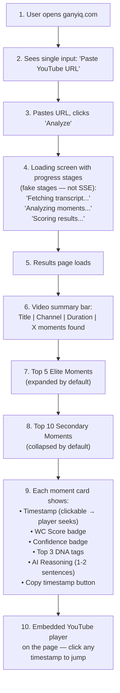
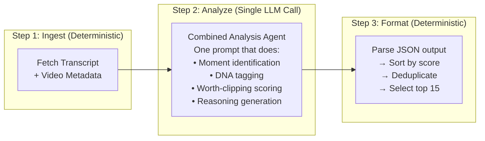
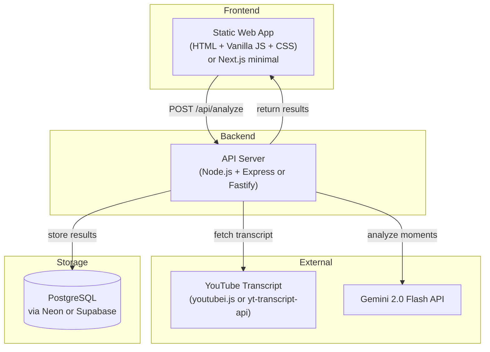

# ganyIQ — MVP LOCK v1

> **Version:** 1.0
> **Date:** 2026-06-01
> **Status:** LOCKED FOR EXECUTION
> **Parent Document:** [MASTER_PLAN_v1.md](file:///root/GANYIQ/MASTER_PLAN_v1.md) (Company Bible — DO NOT MODIFY)
> **Purpose:** Identify the smallest possible version of ganyIQ that validates the core hypothesis. This document is an execution layer. It does not replace, alter, or override any section of the Master Plan.

---

> [!IMPORTANT]
> **Relationship to Master Plan**
>
> `MASTER_PLAN_v1.md` = the full product vision, architecture, engines, roadmap, and strategy. It is the permanent source of truth.
>
> `MVP_LOCK_v1.md` = which pieces of that vision are built NOW vs. LATER. It is a scoping document, not a design document.
>
> If this document and the Master Plan conflict, the Master Plan wins. This document only narrows scope — it never expands, redesigns, or replaces.

---

## Table of Contents

1. [Core Hypothesis](#1-core-hypothesis)
2. [MVP Goal](#2-mvp-goal)
3. [Features Included](#3-features-included)
4. [Features Explicitly Excluded](#4-features-explicitly-excluded)
5. [User Flow](#5-user-flow)
6. [AI Flow](#6-ai-flow)
7. [Simplified Architecture](#7-simplified-architecture)
8. [Single-Agent vs Multi-Agent Recommendation](#8-single-agent-vs-multi-agent-recommendation)
9. [Database Minimal Schema](#9-database-minimal-schema)
10. [API Minimal Schema](#10-api-minimal-schema)
11. [Development Order](#11-development-order)
12. [Launch Criteria](#12-launch-criteria)
13. [Success Metrics](#13-success-metrics)
14. [Validation Metrics](#14-validation-metrics)
15. [Technical Risks](#15-technical-risks)
16. [What Must Be Built Now](#16-what-must-be-built-now)
17. [What Must Wait Until V2](#17-what-must-wait-until-v2)
18. [What Must Wait Until V3](#18-what-must-wait-until-v3)
19. [Founder Recommendation](#19-founder-recommendation)

---

## 1. Core Hypothesis

> **"A professional podcast clipper in Indonesia will use (and eventually pay for) an AI tool that identifies the top worth-clipping moments in a full-length podcast episode faster and more reliably than they can do manually."**

### What This Hypothesis Requires to Be True

| # | Assumption | How MVP Tests It |
|---|---|---|
| H1 | Discovery (not editing) is the primary time bottleneck for clippers | Users engage with results instead of ignoring them |
| H2 | An LLM can identify clip-worthy moments from text transcripts alone | At least 3 of top 5 moments are "obviously correct" per human evaluation |
| H3 | Indonesian YouTube transcripts are accurate enough for AI analysis | Analyses complete without garbage output on >80% of tested videos |
| H4 | Clippers will trust AI-generated recommendations | Users copy timestamps and/or return for additional analyses |
| H5 | Clippers will pay for this | Free-to-paid conversion >3% within 90 days |

### What This Hypothesis Does NOT Test

- Whether a multi-agent pipeline is better than a single agent (optimize later)
- Whether audio/video analysis improves scoring (V3 roadmap)
- Whether the Viral DNA Dataset becomes a defensible moat (requires 6+ months of data)
- Whether agency/team features have demand (V2 scope)

---

## 2. MVP Goal

**Ship a working product to 20-30 real Indonesian podcast clippers within 6 weeks.**

Not 10 weeks. Not 16 weeks. **6 weeks.**

### Why 6 Weeks, Not 10

The Master Plan estimates 10 weeks. That estimate includes:
- Full multi-agent pipeline (overkill for validation)
- SSE real-time streaming (nice-to-have)
- Credits system with tier logic (can be hardcoded)
- Polished landing page (waste before PMF)

Strip all of that. The MVP goal is not "build the product." The goal is **"put AI-generated moment recommendations in front of real clippers and measure whether they use them."**

### MVP Success = One Thing

> If a clipper pastes a YouTube URL, gets results, and **clips at least one moment the AI recommended**, the hypothesis has signal.

---

## 3. Features Included

These are the features that MUST ship in MVP. Each maps to the Master Plan feature list but is scoped to the minimum viable implementation.

| # | Feature | Master Plan Ref | MVP Implementation | Complexity |
|---|---|---|---|---|
| ✅ F1 | **YouTube URL Input** | F1 (P0) | Single input field. Extract video ID. Fetch transcript + metadata. | Low |
| ✅ F2 | **Worth-Clipping Discovery** | F3 (P0) | Single-agent analysis (see Section 8). Not multi-agent. | Medium |
| ✅ F3 | **Top 5 Elite Moments** | F4 (P0) | Display 5 best moments with timestamps, scores, DNA tags, reasoning. | Low |
| ✅ F4 | **Top 10 Secondary Moments** | F5 (P0) | Reduced from 15 → 10 to simplify output. Display with same format. | Low |
| ✅ F5 | **Worth-Clipping Score** | F7 (P0) | Single composite score 0-100. No sub-dimension breakdown in UI (store in DB for analysis). | Low |
| ✅ F6 | **Viral DNA Tags** | F6 (P0) | Top 3 dominant DNA attributes per moment, displayed as tag badges. Full 12-attribute profile stored but not fully displayed. | Low |
| ✅ F7 | **AI Reasoning** | F9 (P0) | 1-2 sentence explanation per moment. | Low |
| ✅ F8 | **Confidence Level** | F8 (P0) | Simple badge: High / Medium / Low. No detailed confidence breakdown. | Low |
| ✅ F9 | **Basic Video Summary** | F2 (P0) + F10 (P0) | Video title, channel, duration, total clippable moments found. No full Clip Density report. | Low |
| ✅ F10 | **Preview Mode** | Post-MVP in Master Plan | **PROMOTED TO MVP.** Click timestamp → YouTube player jumps to moment. This is 2-3 days of work and critical for trust. Without it, the entire value prop is crippled. | Low |
| ✅ F11 | **Copy Timestamp** | Implied in Master Plan | Click to copy timestamp to clipboard. Essential workflow bridge. | Trivial |

### Total Feature Count: 11 features, all low-medium complexity.

> [!WARNING]
> **Preview Mode (F10) is promoted from Post-MVP to MVP.** The Master Plan lists it as Post-MVP Feature 1. I'm overriding that decision here. A clipper who sees "Timestamp: 34:22" but has to manually open YouTube and scrub to 34:22 will NOT complete the trust loop. The embedded player with seek-to-timestamp is the difference between "interesting tool" and "tool I actually use." It's 2-3 days of frontend work. It's non-negotiable.

---

## 4. Features Explicitly Excluded

These features exist in the Master Plan and are **intentionally deferred**. They are NOT cut — they are scheduled for later. The Master Plan remains the authority on their design.

| # | Feature | Master Plan Ref | Why Excluded from MVP | Deferred To |
|---|---|---|---|---|
| ❌ E1 | **Video Quality Assessment** (pre-analysis scoring) | F2 (P0) | Adds an extra step before analysis. MVP should just analyze. Let the results speak. | V2 |
| ❌ E2 | **Full Clip Density Report** | F10 (P0) | Show total moment count only. Full density/opportunity scoring is overengineered for 6-week MVP. | V2 |
| ❌ E3 | **Clip Title Generator** | F11 (P1) | Nice but not essential for hypothesis validation. Clippers write their own titles. | V2 |
| ❌ E4 | **Rejected Moment Analysis** | F12 (P1) | Trust-building feature, but MVP should focus on showing good results, not explaining rejections. | V2 |
| ❌ E5 | **Analysis History** | F13 (P1) | Users can bookmark the results page URL. No need for persistent history in MVP. | V2 |
| ❌ E6 | **Credits System** | Monetization | Hardcode a daily/weekly limit. No tier logic, no credit tracking, no payment integration. | V2 |
| ❌ E7 | **User Accounts / Auth** | Auth | Allow anonymous usage with rate limiting by IP/fingerprint. No signup required. Reduces friction to zero. | V2 |
| ❌ E8 | **SSE Real-Time Progress** | API Architecture | Use simple polling or a loading screen with fake progress stages. SSE is nice engineering but not required for validation. | V2 |
| ❌ E9 | **Multi-Agent Pipeline** | Multi-Agent Architecture (Section 7) | Use simplified 2-phase approach (see Section 8). Full multi-agent orchestration is V2. | V2 |
| ❌ E10 | **Full Scoring Breakdown** | Scoring Framework (Section 10) | Store full breakdown in DB. Show only composite score + top 3 DNA tags in UI. | V2 |
| ❌ E11 | **Viral DNA Dataset Collection** | Defensibility (Section 21) | Store analysis data in PostgreSQL. No separate dataset pipeline. The data accumulates naturally. Formal dataset engineering is V2. | V2 |
| ❌ E12 | **Prompt Versioning System** | AI Prompt Architecture (Section 17) | Hardcode prompts in code. Version control via Git. Formal prompt management is V2. | V2 |
| ❌ E13 | **Channel Intelligence** | V2 Roadmap | V2 | V2 |
| ❌ E14 | **Performance Feedback Loop** | V2 Roadmap | V2 | V2 |
| ❌ E15 | **Export to CapCut** | V2 Roadmap | V2 | V2 |
| ❌ E16 | **Whisper Fallback** | V2 Roadmap | V2 | V2 |
| ❌ E17 | **Emotion Detector (Audio)** | V3 Roadmap | V3 | V3 |
| ❌ E18 | **Video Intelligence Agent** | V3 Roadmap | V3 | V3 |
| ❌ E19 | **Agency Dashboard** | V3 Roadmap | V3 | V3 |
| ❌ E20 | **Batch Analysis** | V3 Roadmap | V3 | V3 |
| ❌ E21 | **Niche Models** | V3 Roadmap | V3 | V3 |
| ❌ E22 | **Competitor Clip Analysis** | V3 Roadmap | V3 | V3 |
| ❌ E23 | **Viral DNA Dataset API** | V3 Roadmap | V3 | V3 |

> [!IMPORTANT]
> **None of these features are deleted.** They all exist in [MASTER_PLAN_v1.md](file:///root/GANYIQ/MASTER_PLAN_v1.md) with full design specifications. They are deferred, not discarded.

---

## 5. User Flow

### MVP User Flow (Stripped to Core)



### What Changed from Master Plan

| Master Plan User Flow | MVP User Flow | Reason |
|---|---|---|
| Signup/login required | No auth. Anonymous access. | Zero friction. Measure engagement before forcing accounts. |
| Credit deduction before analysis | Rate limit by IP (5/day) | No payment infra needed. 5/day is generous enough for beta. |
| SSE real-time progress | Fake progress bar (timed stages) | Simpler. Same perceived UX. |
| 15 secondary moments | 10 secondary moments | Reduces cognitive load and output size |
| Title candidates per moment | Not shown | Deferred to V2 |
| Rejected moment analysis | Not shown | Deferred to V2 |

### Critical UX Decision: No Signup Wall

> [!CAUTION]
> **Do NOT require signup to use the MVP.** Every form field, every password requirement, every email confirmation is friction that kills your ability to validate the hypothesis. Let anyone paste a URL and get results. Rate limit by IP. Add accounts in V2 once you've proven people want this.

---

## 6. AI Flow

### MVP AI Pipeline (Simplified)

The Master Plan defines a 7-component pipeline (Agents 0-6). The MVP collapses this into **3 steps**:



### Why Collapse the Pipeline for MVP

The Master Plan's multi-agent pipeline (Moment Analyst → Worth-Clipping Evaluator → Ranking → Reasoning → Titles) is the correct long-term architecture. But for MVP:

| Concern | Multi-Agent (Master Plan) | Single-Agent (MVP) |
|---|---|---|
| **Development time** | 3-4 weeks | 1 week |
| **Latency** | 40-75s (optimized with parallelism) | 15-40s (1-3 LLM calls) |
| **LLM cost** | ~$0.035/analysis | ~$0.01-0.02/analysis |
| **Debugging** | Must trace across 4 LLM calls | Single prompt to debug |
| **Quality ceiling** | Higher (each agent tuned independently) | Lower, but sufficient for validation |

**The quality difference between single-agent and multi-agent is NOT what determines whether clippers use the product.** If a single well-crafted prompt produces top-5 moments where 3+ are "obviously correct," the hypothesis is validated. You can then upgrade to multi-agent in V2 to improve from 60% accuracy to 75% accuracy.

### MVP Prompt Strategy

Instead of 4 separate agents, use **1-2 LLM calls**:

#### Call 1: Full Analysis (Primary — handles videos up to ~90 minutes)

For shorter videos (transcript fits in context window), send the entire transcript in one call:

```
SYSTEM:
You are a professional short-form content clipper in Indonesia.
Your income depends entirely on views.
You have 3+ years of experience clipping Indonesian podcast content for TikTok, Reels, and Shorts.

TASK:
Analyze this podcast transcript and identify the top 15 moments worth clipping.

For each moment, provide:
1. startTime (seconds) and endTime (seconds) — must be 15-90 seconds
2. worthClippingScore (0-100) — be harsh, only 2-4 should score above 85
3. confidence ("high", "medium", "low")
4. dnaTags — top 3 from: [hookPower, curiosity, controversy, emotion, humor, storytelling, authority, money, shock, educational, motivation, relatability]
5. reasoning — 1-2 sentences explaining why this is worth clipping. Speak like a clipper, not a professor.

RULES:
- Moments must stand alone — a viewer should understand them without watching the full episode
- Strong hooks matter most. If the first 3 seconds don't grab attention, score lower.
- Be honest. If the video has only 5 good moments, return 5. Don't pad to 15.
- Only score based on what's in the transcript. Don't imagine tone or delivery.
- Consider Indonesian audience preferences: controversy, money topics, and relatable humor perform well.

VIDEO:
Title: {title}
Channel: {channel}
Duration: {duration} minutes

TRANSCRIPT:
{transcript}

OUTPUT: JSON array sorted by worthClippingScore descending.
```

#### Call 2: Chunked Analysis (Fallback — handles videos >90 minutes)

If the transcript exceeds context window limits, split into 2-3 chunks with overlap, analyze each separately, then merge and re-rank deterministically.

### Transcript Token Budget

| Video Duration | Approx. Transcript Words | Approx. Tokens | Fits in Single Call? |
|---|---|---|---|
| 30 min | ~5,000 | ~7,500 | ✅ Yes |
| 60 min | ~10,000 | ~15,000 | ✅ Yes |
| 90 min | ~15,000 | ~22,500 | ✅ Yes (with Gemini 1M context) |
| 120 min | ~20,000 | ~30,000 | ✅ Yes (with Gemini 1M context) |
| 180 min | ~30,000 | ~45,000 | ✅ Yes (with Gemini 1M context) |

With **Gemini 2.0 Flash** (1M token context window), virtually all podcasts fit in a single call. This eliminates the need for segment splitting entirely in MVP.

> [!TIP]
> **This is a massive simplification.** The Master Plan's Segment Splitter (Agent 1) exists because older models had 4K-32K context windows. With Gemini's 1M context, you can feed the entire transcript at once. The segment splitting architecture in the Master Plan becomes relevant only when (a) you need more granular analysis per segment, or (b) you switch to a model with smaller context. Both are V2 concerns.

---

## 7. Simplified Architecture

### MVP Architecture (Minimal)



### What's Removed from Master Plan Architecture

| Master Plan Component | MVP Status | Why |
|---|---|---|
| Redis | ❌ Removed | No job queue needed. Analysis runs synchronously (15-40s) or with a simple setTimeout. |
| BullMQ Job Queue | ❌ Removed | No async job processing. Single request → single response. If latency is >30s, use a loading screen. |
| Auth Middleware | ❌ Removed | No auth. Rate limit by IP using in-memory counter or simple middleware. |
| Credits Module | ❌ Removed | Hardcoded daily limit check. |
| Pipeline Orchestrator | ❌ Simplified | Linear: fetch transcript → call LLM → parse → sort → respond. No orchestration framework needed. |
| SSE Streaming | ❌ Removed | Loading screen with timed stages. |
| Prompt Versioning | ❌ Removed | Prompts live in code. Git is your version control. |
| Scoring Module | ❌ Simplified | LLM outputs the score directly. Deterministic post-processing is just sort + deduplicate. |

### MVP Tech Stack (Minimal)

| Layer | Technology | Cost |
|---|---|---|
| **Frontend** | Next.js (App Router) OR plain HTML/CSS/JS | $0 (Vercel free tier or static hosting) |
| **Backend** | Node.js + Fastify (single file is fine) | $5-20/month (Railway Hobby) |
| **Database** | PostgreSQL via Neon | $0 (free tier: 0.5GB) |
| **LLM** | Gemini 2.0 Flash | ~$0.01-0.02/analysis |
| **Transcript** | `youtubei.js` (JavaScript) | $0 |
| **Hosting** | Railway (backend) + Vercel (frontend) | $5-20/month total |
| **DNS** | Cloudflare | $0 |
| **Total Monthly** | | **$5-40/month** |

> [!NOTE]
> **Total MVP infrastructure cost: $5-40/month.** Compare this to the Master Plan's $80-270/month. The MVP is 80% cheaper because it eliminates Redis, BullMQ, monitoring services, and complex infrastructure. This is intentional. Spend money on infrastructure only after you've proven demand.

---

## 8. Single-Agent vs Multi-Agent Recommendation

### Recommendation: Start Single-Agent, Migrate to Multi-Agent in V2

| Phase | Architecture | When |
|---|---|---|
| **MVP (Now)** | Single combined prompt (1-2 LLM calls) | Weeks 1-6 |
| **V1.5 (Post-validation)** | 2-agent pipeline: Analyzer + Evaluator | Weeks 7-10 (if hypothesis validated) |
| **V2 (Scale)** | Full multi-agent pipeline per Master Plan | Month 4-6 |

### Single-Agent MVP Design

```
[Transcript] → [Single LLM Call] → [JSON Output] → [Deterministic Sort/Dedup] → [Display]
```

The single agent receives:
- Full transcript
- Video metadata
- Role prompt (professional Indonesian clipper)
- Output schema (JSON array of moments)

It outputs:
- Up to 15 moments, each with: timestamp, score, confidence, DNA tags, reasoning

### When to Upgrade to Multi-Agent

Upgrade when ANY of these are true:
1. **Quality plateau:** Single prompt accuracy stalls at <65% and prompt engineering can't improve it
2. **User feedback:** Clippers consistently say "the scores are off" or "the reasoning doesn't match the score"
3. **Scale need:** Processing time matters and you need parallel agents for speed
4. **Feature need:** You need independent tuning of DNA detection vs. scoring vs. reasoning

### What Single-Agent Sacrifices

| Capability | Multi-Agent (Master Plan) | Single-Agent (MVP) |
|---|---|---|
| Independent tuning per skill | ✅ Each agent has its own prompt | ❌ One prompt, all skills interleaved |
| Score consistency | ✅ Deterministic scoring module validates scores | ❌ LLM self-scores (less consistent) |
| Debugging granularity | ✅ Can trace which agent failed | ❌ Single point of failure |
| Parallel processing | ✅ Agents can run concurrently | ❌ Sequential |
| DNA accuracy | ✅ Dedicated Moment Analyst | ⚠️ DNA tags are secondary to scoring |

These sacrifices are acceptable for validation. None of them prevent you from testing the core hypothesis.

---

## 9. Database Minimal Schema

### Design Principle

Store everything you'll need for V2 even if you don't display it in MVP. The cost of storing extra columns is zero. The cost of losing data you'll need later is high.

### MVP Schema (PostgreSQL — Neon Free Tier)

```sql
-- Videos (cached — avoid re-fetching)
CREATE TABLE videos (
    id UUID PRIMARY KEY DEFAULT gen_random_uuid(),
    youtube_id VARCHAR(20) UNIQUE NOT NULL,
    title TEXT,
    channel_name VARCHAR(255),
    duration_seconds INT,
    transcript JSONB,
    fetched_at TIMESTAMP WITH TIME ZONE DEFAULT NOW()
);

-- Analyses (one per URL submission)
CREATE TABLE analyses (
    id UUID PRIMARY KEY DEFAULT gen_random_uuid(),
    video_id UUID NOT NULL REFERENCES videos(id),
    ip_address VARCHAR(45), -- rate limiting (no user accounts)
    total_moments_found INT,
    processing_time_ms INT,
    llm_model VARCHAR(50) DEFAULT 'gemini-2.0-flash',
    prompt_version VARCHAR(20) DEFAULT 'mvp-v1',
    raw_llm_response JSONB, -- store the full LLM output for debugging
    status VARCHAR(20) DEFAULT 'completed',
    created_at TIMESTAMP WITH TIME ZONE DEFAULT NOW()
);

-- Moments (the core output)
CREATE TABLE moments (
    id UUID PRIMARY KEY DEFAULT gen_random_uuid(),
    analysis_id UUID NOT NULL REFERENCES analyses(id) ON DELETE CASCADE,
    start_time NUMERIC(10,2) NOT NULL,
    end_time NUMERIC(10,2) NOT NULL,
    worth_clipping_score NUMERIC(5,2) NOT NULL,
    confidence VARCHAR(10) NOT NULL, -- 'high', 'medium', 'low'
    dna_tags JSONB NOT NULL, -- ["hookPower", "controversy", "authority"]
    reasoning TEXT,
    transcript_excerpt TEXT,
    rank_position INT,
    tier VARCHAR(10) -- 'elite' or 'secondary'
);

CREATE INDEX idx_moments_analysis_id ON moments(analysis_id);
CREATE INDEX idx_moments_score ON moments(worth_clipping_score DESC);
```

### What's Different from Master Plan Schema

| Master Plan Table | MVP Status | Reason |
|---|---|---|
| `users` | ❌ Not created | No auth in MVP |
| `videos` | ✅ Simplified | Removed: `channel_id`, `view_count`, `description`, `language`. Keep it minimal. |
| `analyses` | ✅ Simplified | Removed: `user_id`, `video_opportunity_score`, `clip_density_score`, `elite_moments`. Added: `ip_address`, `raw_llm_response`. |
| `moments` | ✅ Simplified | `confidence` is string not float. `dna_tags` is simple array, not full profile. No `score_breakdown`. No `dna_signature`. |
| `dna_tags` | ❌ Not created | DNA tags stored as JSONB array on `moments` table. No need for normalized table in MVP. |
| `title_candidates` | ❌ Not created | Feature deferred to V2. |
| `rejected_moments` | ❌ Not created | Feature deferred to V2. |
| `clip_density` | ❌ Not created | Feature deferred to V2. |
| `viral_dna_dataset` | ❌ Not created | The data accumulates in `moments` table. Formal dataset extraction is V2. |

### Critical MVP Data Decision

> [!IMPORTANT]
> **Store `raw_llm_response` in every analysis.** This is the most important column in the MVP. It lets you:
> - Debug bad results without re-running the analysis
> - Retroactively extract data you didn't think to store
> - Compare prompt versions by replaying the same transcript
> - Feed into the Viral DNA Dataset later without re-analyzing

---

## 10. API Minimal Schema

### MVP Endpoints (3 Total)

The Master Plan defines 11+ endpoints. MVP needs **3**.

| Method | Endpoint | Description |
|---|---|---|
| `POST` | `/api/analyze` | Submit YouTube URL. Runs analysis synchronously. Returns full results. |
| `GET` | `/api/analyze/:id` | Retrieve a previously completed analysis by ID. |
| `GET` | `/api/health` | Health check. Returns 200. |

That's it. Three endpoints.

### POST `/api/analyze` — Full Spec

**Request:**
```json
{
  "youtubeUrl": "https://www.youtube.com/watch?v=abc123"
}
```

**Validation:**
- URL must be a valid YouTube URL (regex check)
- Video must have an available transcript
- Video duration must be ≤180 minutes
- IP rate limit: max 5 analyses per day

**Response (Success — 200):**
```json
{
  "analysisId": "uuid",
  "video": {
    "youtubeId": "abc123",
    "title": "Deddy Corbuzier x Hotman Paris",
    "channel": "Deddy Corbuzier",
    "durationMinutes": 98
  },
  "totalMomentsFound": 12,
  "processingTimeMs": 23400,
  "eliteMoments": [
    {
      "rank": 1,
      "startTime": 2042.5,
      "endTime": 2098.0,
      "startTimestamp": "34:02",
      "endTimestamp": "34:58",
      "worthClippingScore": 91,
      "confidence": "high",
      "dnaTags": ["controversy", "authority", "hookPower"],
      "reasoning": "Guest drops a controversial claim about Indonesian tax policy that would trigger massive debate. Strong hook — opens with 'Tidak ada orang kaya yang bayar pajak penuh.' Authority signal: guest is a known tax lawyer."
    }
  ],
  "secondaryMoments": [
    /* up to 10 more moments, same structure */
  ]
}
```

**Response (Error):**
```json
{
  "error": "TRANSCRIPT_UNAVAILABLE",
  "message": "No transcript found for this video. Try a video with captions enabled."
}
```

**Error Codes:**
| Code | Meaning |
|---|---|
| `INVALID_URL` | Not a valid YouTube URL |
| `TRANSCRIPT_UNAVAILABLE` | No captions/transcript for this video |
| `VIDEO_TOO_LONG` | Exceeds 180-minute limit |
| `RATE_LIMITED` | IP has exceeded 5 analyses/day |
| `ANALYSIS_FAILED` | LLM call failed or returned unparseable output |

### Why Synchronous, Not Async

The Master Plan recommends async (job queue + SSE). For MVP:

- Gemini 2.0 Flash processes a 2-hour transcript in **10-30 seconds**
- Total request time including transcript fetch: **15-40 seconds**
- A 30-second loading screen is acceptable for MVP
- Async adds: Redis, BullMQ, SSE endpoint, job status polling, failure recovery
- That's 1-2 weeks of engineering for marginal UX improvement

**Ship sync. Add async in V2 if latency becomes a complaint.**

---

## 11. Development Order

### Week-by-Week Execution Plan

#### Week 1: Foundation + Transcript Pipeline

| Day | Task | Output |
|---|---|---|
| Mon | Set up project: Node.js + Fastify, PostgreSQL (Neon), project structure | Running server with health check endpoint |
| Tue | YouTube transcript extraction: `youtubei.js` integration | Function: `getTranscript(url) → {metadata, transcript}` |
| Wed | Test transcript extraction on 10 Indonesian podcasts. Document failures. | Quality report: X/10 videos have usable transcripts |
| Thu | Database schema setup. Video caching (don't re-fetch same video). | Working DB with `videos` table, insert/fetch |
| Fri | API endpoint: `POST /api/analyze` — validates URL, fetches transcript, stores video, returns transcript | Working endpoint (no LLM yet — returns raw transcript) |

**Week 1 Deliverable:** Backend that fetches and caches YouTube transcripts. Transcript quality validated on real Indonesian podcasts.

> [!CAUTION]
> **STOP after Week 1 if >50% of tested videos have unusable transcripts.** This is the technical kill switch. If transcripts are garbage, the entire product thesis fails. Do not proceed to Week 2 until transcript quality is confirmed on at least 8/10 test videos.

#### Week 2: AI Analysis Pipeline

| Day | Task | Output |
|---|---|---|
| Mon | Write the combined analysis prompt. Test on 3 transcripts manually (via Gemini API playground). | Working prompt that outputs structured JSON |
| Tue | Integrate Gemini API into backend. Wire up: transcript → prompt → LLM call → JSON parse. | Function: `analyzeTranscript(transcript, metadata) → moments[]` |
| Wed | Add output validation: verify timestamps exist in transcript, scores are 0-100, JSON schema check. | Validated, parsed output |
| Thu | Add deterministic post-processing: sort by score, deduplicate (30s proximity), assign tiers. | Function: `rankMoments(moments) → {elite, secondary}` |
| Fri | Complete `POST /api/analyze` endpoint: transcript fetch → LLM analysis → store in DB → return results. Store `raw_llm_response`. | **Fully working API endpoint.** |

**Week 2 Deliverable:** Working API that accepts a YouTube URL and returns scored, ranked moments. Can be tested via `curl`.

#### Week 3: Quality Tuning

| Day | Task | Output |
|---|---|---|
| Mon-Tue | Test the pipeline on 10 real Indonesian podcasts. For each, manually validate: are the top 5 moments "obviously correct"? | Quality scorecard: X/10 videos have ≥3/5 correct elite moments |
| Wed-Thu | Prompt iteration. Adjust based on failure patterns. Re-test. | Improved prompt. Quality target: 7/10 videos pass. |
| Fri | Establish prompt evaluation suite: 5 "golden" transcripts with known correct moments. Run all future prompt changes against this suite. | Repeatable evaluation process |

**Week 3 Deliverable:** Validated AI quality. Confidence that the system produces useful results.

> [!WARNING]
> **Do NOT start frontend until Week 3 is complete.** If the AI quality is bad, no amount of UI will save the product. Week 3 is the second kill switch. If you can't achieve ≥3/5 correct moments on 7/10 test videos, pause and focus exclusively on prompt engineering until quality is acceptable.

#### Week 4: Frontend — Results Page

| Day | Task | Output |
|---|---|---|
| Mon | Set up Next.js (or plain HTML/JS). Create results page layout. | Blank page with sections for video info, elite moments, secondary moments |
| Tue | Build moment card component: timestamp, score badge, confidence badge, DNA tags, reasoning. | Styled moment cards displaying real data |
| Wed | Build video summary bar. Wire up API: results page fetches from `GET /api/analyze/:id`. | Results page displays real analysis data |
| Thu | Add YouTube embedded player with seek-to-timestamp on click. | **Preview Mode working.** |
| Fri | Polish: responsive layout (must work on mobile), loading states, error states. | Usable results page |

**Week 4 Deliverable:** Working results page that displays real analysis data with Preview Mode.

#### Week 5: Frontend — Input + Flow

| Day | Task | Output |
|---|---|---|
| Mon | Build input page: single URL input, "Analyze" button, URL validation. | Input page with basic validation |
| Tue | Build loading screen: timed fake progress ("Fetching transcript... Analyzing moments... Scoring results..."). | Loading experience |
| Wed | Connect input → loading → results flow. Handle errors (no transcript, rate limited, etc.). | **Complete user flow working end-to-end.** |
| Thu | Add rate limiting: 5 analyses/day per IP. Display remaining analyses count. Copy timestamp button. | Rate limiting + utility features |
| Fri | Bug fixes, edge cases, mobile testing. | Stable application |

**Week 5 Deliverable:** Complete, working web application.

#### Week 6: Deploy + Beta Launch

| Day | Task | Output |
|---|---|---|
| Mon | Deploy backend to Railway. Deploy frontend to Vercel. Configure domain (ganyiq.com or subdomain). | Live application at a URL |
| Tue | Test end-to-end on production. Fix deployment issues. | Stable production deployment |
| Wed | Prepare beta outreach: write intro message for Telegram groups, prepare 2-3 example analysis screenshots. | Marketing materials |
| Thu | Send to first 10 beta testers (hand-picked clippers from Telegram groups). Collect feedback via DM. | First real user feedback |
| Fri | Fix critical bugs reported by beta testers. Expand to 20-30 beta users. | **MVP LIVE with real users.** |

**Week 6 Deliverable:** Live product with 20-30 real users providing feedback.

---

## 12. Launch Criteria

The MVP is ready to launch when ALL of these are true:

| # | Criterion | Measurement |
|---|---|---|
| LC1 | API accepts YouTube URL and returns moments in <45 seconds | Tested on 10 videos, 90th percentile <45s |
| LC2 | At least 3 of top 5 moments are "obviously correct" on 7/10 test videos | Human evaluation by founder |
| LC3 | Transcript extraction works for >80% of popular Indonesian podcast videos | Tested on 20 videos |
| LC4 | Results page displays correctly on desktop Chrome and mobile Chrome | Visual QA |
| LC5 | Preview Mode (click timestamp → player seeks) works | Functional test |
| LC6 | Rate limiting works (no one can abuse the system) | Test with >5 requests from same IP |
| LC7 | Error messages are clear (no transcript, video too long, rate limited) | Test each error path |
| LC8 | Application is deployed and accessible via public URL | Smoke test |

### Launch Criteria NOT Required

These are NOT required to launch:
- Pretty design (functional > beautiful for beta)
- Perfect accuracy (65% is acceptable, improve with feedback)
- Payment integration (free beta)
- User accounts (anonymous)
- Mobile-optimized editing (results must be readable, not perfect)

---

## 13. Success Metrics

### MVP-Specific Metrics (First 30 Days Post-Launch)

| Metric | Target | Measurement Method |
|---|---|---|
| **Total analyses completed** | >100 | Database count |
| **Unique users** (unique IPs) | >30 | Database count |
| **Repeat usage** (same IP, >1 analysis) | >40% of users | Database query |
| **Timestamp clicks** (Preview Mode usage) | >50% of sessions | Frontend event tracking (PostHog or simple counter) |
| **Positive feedback from beta users** | >60% say "this is useful" | Direct DM feedback |
| **Processing success rate** | >90% (analyses that complete without error) | Error rate monitoring |
| **Average processing time** | <40 seconds | Database `processing_time_ms` |

### Kill Metrics (Stop and Reassess If)

| Signal | Threshold | Action |
|---|---|---|
| Nobody returns after first use | <15% repeat usage after 2 weeks | Interview churned users. Is the quality bad? Is the problem wrong? |
| Analyses complete but users don't engage with results | <30% timestamp click rate | Results aren't useful. Prompt quality issue. |
| Can't find 30 beta testers | <15 users after 2 weeks of outreach | Market too small or wrong channel |
| >50% of videos fail transcript extraction | Persistent across different channels | Technical thesis broken. Need Whisper. |

---

## 14. Validation Metrics

### What MVP Validates (Mapped to Hypothesis)

| Hypothesis | Validation Metric | Validated If |
|---|---|---|
| H1: Discovery is the bottleneck | Repeat usage rate | >40% of users return within 7 days |
| H2: LLM can find clip-worthy moments | Moment accuracy (human eval) | ≥3/5 elite moments are "correct" on 70%+ of videos |
| H3: Indonesian transcripts are usable | Transcript success rate | >80% of submitted videos have usable transcripts |
| H4: Clippers trust AI recommendations | Timestamp click rate + qualitative feedback | >50% of sessions include timestamp clicks, >60% positive feedback |
| H5: Clippers will pay | Willingness survey + usage intensity | >40% say they'd pay in survey, power users analyze >5 videos/week |

### How to Measure Without Analytics Infrastructure

MVP doesn't need PostHog or Mixpanel. Use these lightweight alternatives:

1. **Database queries:** All core metrics (analyses, unique IPs, repeat usage, processing time) are queryable from PostgreSQL.
2. **Simple frontend counter:** Add a `fetch('/api/track', { event: 'timestamp_click', analysisId })` call. Store in a `events` table. 10 lines of code.
3. **Direct feedback:** DM beta users on Telegram. Ask 3 questions:
   - "Did you find useful moments?"
   - "Did you actually clip any?"
   - "Would you pay IDR 99K/month for this?"

### Minimal Events Table (Add to Schema)

```sql
CREATE TABLE events (
    id UUID PRIMARY KEY DEFAULT gen_random_uuid(),
    analysis_id UUID REFERENCES analyses(id),
    event_type VARCHAR(50) NOT NULL, -- 'timestamp_click', 'copy_timestamp', 'page_view'
    metadata JSONB, -- {momentRank: 1, startTime: 2042.5}
    ip_address VARCHAR(45),
    created_at TIMESTAMP WITH TIME ZONE DEFAULT NOW()
);
```

---

## 15. Technical Risks

### MVP-Specific Risks (Subset of Master Plan Section 23)

| # | Risk | Severity | Likelihood | MVP Mitigation |
|---|---|---|---|---|
| R1 | **Transcript unavailable** | 🔴 Critical | Medium | Test 20 videos in Week 1. If >50% fail, STOP. This is the kill switch. |
| R2 | **LLM returns unparseable JSON** | 🟡 Medium | Medium | JSON schema validation. Retry once with "Please output valid JSON" appended. If retry fails, return error. |
| R3 | **LLM hallucinates timestamps** | 🟡 Medium | Medium | Cross-reference all returned timestamps against transcript time ranges. Reject moments with invalid timestamps. |
| R4 | **Processing takes >60 seconds** | 🟡 Medium | Low | Gemini Flash is fast. If timeout occurs, reduce transcript size (truncate to first 90 minutes). |
| R5 | **Gemini API rate limits** | 🟡 Medium | Low | Free tier: 15 RPM. Paid tier: much higher. With 5/day per user and <30 users, unlikely to hit limits. |
| R6 | **YouTube blocks transcript extraction** | 🔴 Critical | Low | Use `youtubei.js` which mimics browser requests. Have `youtube-transcript-api` (Python) as fallback. |
| R7 | **MVP is too slow (>40s loading)** | 🟡 Medium | Medium | Acceptable for beta. Fake progress bar reduces perceived wait time. Optimize in V2. |

### Risks NOT Relevant to MVP

These risks from the Master Plan are explicitly irrelevant for MVP:
- LLM costs exceeding revenue (no revenue in MVP — it's free)
- Prompt injection (low user count, monitored manually)
- Concurrency issues (rate limited to 5/day per IP)
- Job queue failures (no job queue)
- SSE streaming issues (no SSE)

---

## 16. What Must Be Built Now

### The Non-Negotiable MVP Checklist

```
[ ] YouTube transcript extraction (Node.js, using youtubei.js)
[ ] Video metadata fetching (title, channel, duration)
[ ] Video caching in PostgreSQL (don't re-fetch same video)
[ ] Combined analysis prompt (single LLM call via Gemini 2.0 Flash)
[ ] JSON output parsing + validation
[ ] Timestamp cross-referencing (reject hallucinated timestamps)
[ ] Deterministic ranking (sort, deduplicate, assign tiers)
[ ] POST /api/analyze endpoint (synchronous)
[ ] GET /api/analyze/:id endpoint
[ ] IP-based rate limiting (5/day)
[ ] Frontend: URL input page
[ ] Frontend: loading screen with progress stages
[ ] Frontend: results page with moment cards
[ ] Frontend: YouTube embedded player with seek-to-timestamp (Preview Mode)
[ ] Frontend: copy timestamp button
[ ] Frontend: mobile-responsive results page
[ ] Error handling (no transcript, too long, rate limited, LLM failure)
[ ] Database: videos, analyses, moments tables
[ ] Database: events table (for tracking timestamp clicks)
[ ] Deployment: backend on Railway, frontend on Vercel
[ ] Domain setup (ganyiq.com or temp subdomain)
[ ] Prompt evaluation suite (5 golden transcripts)
```

---

## 17. What Must Wait Until V2

### V2 = Post-Validation Improvements (Month 2-4)

These are features and infrastructure from the Master Plan that activate ONLY after MVP validates the hypothesis.

| Component | Master Plan Section | V2 Implementation |
|---|---|---|
| **Multi-Agent Pipeline** | Section 7 | Split single agent into Moment Analyst + Worth-Clipping Evaluator + Reasoning Generator |
| **User Accounts + Auth** | Section 14-15 | Email/password registration. JWT auth. Per-user analysis history. |
| **Credits System + Payment** | Section 22 | Stripe/Xendit integration. Free (3/month) + Starter (IDR 99K/month). |
| **Full Scoring Breakdown** | Section 10 | Display sub-scores (hook strength, standalone clarity, etc.) in UI |
| **Full DNA Profile** | Section 8 | Display all 12 DNA attributes with scores, not just top 3 tags |
| **Clip Density Report** | Section 12 | Video Opportunity Score, Clip Density Score, density label, recommendation |
| **Video Quality Assessment** | Section 6 (F2) | Pre-analysis quality check |
| **Clip Title Generator** | Section 6 (F11) | 3-5 title candidates per moment |
| **Rejected Moment Analysis** | Section 6 (F12) | Show near-misses with rejection reasoning |
| **Analysis History** | Section 6 (F13) | Per-user history page with past analyses |
| **SSE Real-Time Progress** | Section 15 | Real progress updates during analysis |
| **Async Job Queue** | Section 16 | BullMQ on Redis for background processing |
| **Confidence Engine (Full)** | Section 11 | Multi-factor confidence calculation instead of simple LLM-assigned label |
| **Prompt Versioning** | Section 17 | Track which prompt version produced which analysis |
| **Viral DNA Dataset Pipeline** | Section 21 | Formal extraction from moments → aggregated dataset |
| **Channel Intelligence** | V2 Roadmap | Channel-specific audience calibration |
| **Performance Feedback Loop** | V2 Roadmap | "Did you clip this?" button → feedback data |
| **Export to CapCut** | V2 Roadmap | Timestamp export in CapCut format |
| **Whisper Fallback** | V2 Roadmap | Transcription for videos without captions |
| **Pro Tier** | V2 Roadmap | 100 analyses/month, priority processing |

---

## 18. What Must Wait Until V3

### V3 = Scale + Intelligence (Month 6-12)

These are advanced features from the Master Plan that require V2 infrastructure and significant user base.

| Component | Master Plan Section | Why V3 |
|---|---|---|
| **Emotion Detector (Audio)** | V3 Roadmap | Requires audio processing pipeline, new model integration, additional compute |
| **Video Intelligence Agent** | V3 Roadmap | Requires video frame analysis, CV models, significant compute |
| **Agency Dashboard** | V3 Roadmap | Requires multi-user workspace, team management, role-based access |
| **Viral DNA Dataset API** | V3 Roadmap | Requires meaningful dataset size (10K+ moments), API infra, licensing framework |
| **Batch Analysis** | V3 Roadmap | Requires async infrastructure, queue management, cross-video comparison |
| **Niche Models** | V3 Roadmap | Requires sufficient data per niche for fine-tuning |
| **Competitor Clip Analysis** | V3 Roadmap | Requires TikTok/Reels scraping, reverse-engineering clip performance |
| **White-Label Licensing** | Section 22 | Requires mature, stable product + legal framework |
| **Multi-Language Support** | Implied | Requires prompt localization, transcript handling per language |
| **Source Video Finder** | Critique Section | Requires podcast index, trending detection, recommendation engine |

---

## 19. Founder Recommendation

### The Exact Next Action After MVP LOCK Is Completed

Do NOT start coding.

### Step 1: Pre-Build Validation (This Week — 3-5 Days)

**Day 1-2: Find Your Users**

1. Search Telegram for Indonesian clipper groups. Target keywords: "clipper podcast", "konten kreator", "short form content", "podcast clipping".
2. Search Facebook Groups for the same.
3. Search TikTok for Indonesian accounts that post podcast clips. DM 10 of them.
4. Goal: identify 5+ active communities with 100+ members each.

**If you cannot find 5 communities or 50 identifiable active clippers, the market may be too small. Expand scope to "all Indonesian content clippers" before proceeding.**

**Day 2-3: Test Transcript Quality**

1. Pick 20 popular Indonesian podcasts from YouTube (Deddy Corbuzier, Podcast Awal Minggu, Close The Door, Boy William, Helmy Yahya, etc.)
2. Attempt to extract transcripts using `youtubei.js` or YouTube's caption system.
3. For each, evaluate: Is the transcript usable? Rate: Good / Mediocre / Unusable.
4. Goal: >80% of videos have Good or Mediocre (workable) transcripts.

**If <80% of videos have usable transcripts, you need Whisper from Day 1. This changes the MVP timeline from 6 weeks to 8-9 weeks and increases cost. Make this decision explicitly.**

**Day 3-5: Test AI Quality**

1. Take 5 transcripts from the extraction test.
2. Manually paste them into Gemini 2.0 Flash (via API or AI Studio) with the MVP combined analysis prompt.
3. For each, check: Are the top 5 moments obviously correct? Would a real clipper agree?
4. Goal: ≥3/5 moments are correct on ≥4/5 test videos.

**If AI quality is below this threshold, iterate the prompt. If you cannot reach acceptable quality after 10 prompt iterations, the technical thesis may not hold. Reconsider the approach before writing any backend code.**

### Step 2: Build MVP (Weeks 1-6)

Follow the exact development order in Section 11. Respect the kill switches:
- **Week 1 Kill Switch:** >50% transcript failures → STOP
- **Week 3 Kill Switch:** <3/5 moments correct on 7/10 videos → STOP and focus on prompt quality

### Step 3: Beta Launch (Week 6)

- Deploy to production
- Share with 20-30 hand-picked beta clippers
- Collect feedback via Telegram DM
- Track metrics for 2-4 weeks

### Step 4: Decision Point (Week 8-10)

After 2-4 weeks of beta data, make ONE of these decisions:

| Signal | Decision |
|---|---|
| **Strong signal:** >40% repeat usage, >60% positive feedback, clippers actually clip AI-recommended moments | Proceed to V2. Add auth, payments, multi-agent pipeline. |
| **Moderate signal:** 20-40% repeat usage, mixed feedback, quality complaints | Stay in MVP. Focus entirely on prompt quality improvement for 4 more weeks. |
| **Weak signal:** <20% repeat usage, negative feedback, users don't engage with results | Pivot or kill. Interview users to understand why. Consider pivots outlined in Master Plan Section 29. |
| **No users:** Can't find 30 beta testers despite community outreach | Market too small. Expand scope or pivot market. |

### The One Rule

> **Do not build V2 features until MVP metrics justify it.** Every week spent on infrastructure, auth systems, payment integrations, or multi-agent pipelines before validation is a week wasted if the hypothesis is wrong. The MVP exists to answer one question: **"Will clippers use AI-recommended moments?"** Nothing else matters until that's answered.

---

> [!IMPORTANT]
> **Document Hierarchy**
>
> 📕 `MASTER_PLAN_v1.md` = Company Bible. Full vision. Never modified by MVP decisions.
>
> 📗 `MVP_LOCK_v1.md` = Current Execution Plan. What is built now. What waits.
>
> Future documents will reference both. Any AI session working on ganyIQ must read both files before making decisions.

---

> [!CAUTION]
> **Final Warning to the Founder**
>
> You now have two documents: a 30-section strategic vision and a 19-section execution plan. You have more documentation than most Series A startups. The risk is no longer "lack of clarity." The risk is **"building too much before validating."**
>
> The next 3-5 days should involve ZERO code. Talk to clippers. Test transcripts. Test prompts. If all three pass, start building Monday. If any fail, you just saved 6 weeks of wasted engineering.
